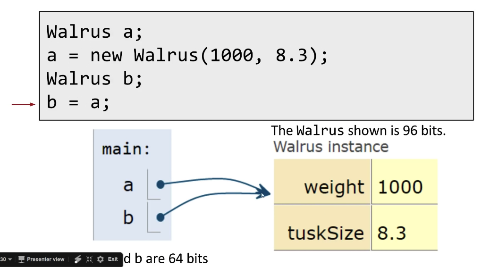
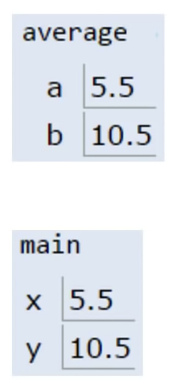
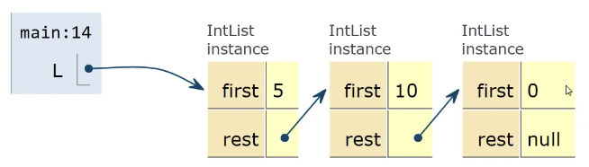

# Lecture 3: References, Recursion, and Lists
#### 8/31/2020


## Primitive Types

### Variables in Java
```
Walrus a = new Walrus(1000, 8.3);
Walrus b;
b = a;
b.weight = 5;
System.out.println(a);
System.out.println(b);

Result:
5
5
```
- The change to b will affect a
```
int x = 5;
int y;
y = x;
x = 2;
System.out.println(x);
System.out.println(y);

Result:
2
5
```
- The change to x will not affect y

### Bits
- Your computer stores information in "memory"
  - Information is stored in memory as a sequence of ones and zeros
    - Example: 72 stored as 01001000
    - Example: Letter H stored as 01001000 (same as the number 72)
    - Example: True stored as 00000001
- Each Java type has a different way to interpret the bits:
  - 8 primitive types in Java:
    - byte
    - short
    - int
    - long
    - float
    - double
    - boolean
    - char

### Declaring a Variable (simplified)
```
int x;
double y;
x = -1431195969;
y = 567213.112
```
- When you declare a variable of a certain type in Java:
  - Your computer sets aside exactly enough bits to hold a thing of that type
    - Ex: Declaring an int sets aside a "box" of 32 bits
    - Ex: Declaring a double sets aside a box of 64 bits
  - Java creates an internal table that maps each variable name to a location
  - Java does NOT write anything into the reserved boxes
    - For safety, Java will not let access a variable that is uninitialized

### Simplified Box Notation
- We'll use simplified box notation
  - Instead of writing memory box contents in binary, we'll write them in human readable code

### The Golden Rule of Equals (GRoE)
- Given variables y and x:
  - `y = x` **copies** all the bits from x into y


## Reference Types

### Reference Types
- There are 8 primitive types in Java
- Everything else, including arrays, is a **reference type**

### Class Instantiations
- When we instantiate an Object
  - Java first allocates a box of bits for each instance variable of the class and fills them with a default value (e.g. 0, null)
  - The constructor then usually fills every box with some other value
```
public class Walrus {
    public int weight;
    public double tuskSize;

    public Walrus(int w, double ts) {
        weight = w;
        tuskSize = ts;
    }
}
```
- Can think of `new` as returning the address of the newly created object
  - Addresses in Java are 64 bits
  - Example: If object is created in memory location 111111111, then new returns 1111111111

### Reference Type Variable Declarations
- When we declare a variable of any reference type:
  - Java allocates exactly a box of size 64 bits, no matter what type of object
  - These bits can be either set to:
    - Null (all zeros)
      ```
      Walrus someWalrus;
      someWalrus = null;
      ``` 
    - The 64 bit "address" of a specific instance of that class (returned by `new`)
      ```
      Walrus someWalrus;
      someWalrus = new Walrus(1000, 8.3);
      ``` 
- The 64 bit addresses are meaningless to us as humans, so we'll represent:
  - All zero addresses with "null"
  - Non-zero addresses as arrows
  - Basically, the box-and-pointer notation from CS 61A

### Reference Types Obey the Golden Rule of Equals
- Just as with primitive types, the equals sign copies the bits
  - In terms of our visual metaphor, we "copy" the arrow by making the arrow in the b box point at the same instance as a
    - a and b are 64 bits




## Parameter Passing

### The Golden Rule of Equals (and Parameter Passing)
- Given variables b and a:
  - `b = a` copies all the bits from a into b
- Passing parameters obeys the same rule: Simply **copy the bits** to the new scope (parameters are "passed by value")
```
public static double average(doubl a, double b) {
    return (a + b) / 2;
}

public static void main(String[] args) {
    double x = 5.5;
    double y = 10.5;
    double avg = average(x, y);
}
```


### The Golden Rule: Summary
- There are - types of variables in Java:
  - 8 primitive types
  - The 9th type is references to Objects (an arrow). References may be null
- In box-and-pointer notation, each variable is drawn as a labeled box and values are shown in the box
  - Addresses are represented by arrows to object instances
- The golden rule:
  - `b = a` **copies the bits** from a into b
  - Passing parameters **copies the bits**


## Instantiation of Arrays

### Declaration and Instantiation of Arrays
- Arrays are also Objects. As we've seen, objects are instantiated using the `new` keyword
  - `int[] x = new int[]{0, 1, 2, 95, 4};`
- `int[] a;`: Declaration
  - Declaration creates a 64 bit box intended only for storing a reference to an int array. **No object is instantiated**
- `new int[]{0, 1, 2, 95, 4};`: Instantiation
  - Instantiates a new Object, in this case an int array
  - Object is anonymous!

### Assignment of Arrays
- `int[] x = new int[]{0, 1, 2, 95, 4};`
  - Creates a 64 bit box for storing an int array address
  - Creates a new Object, in this case an int array (Instantiation)
  - Puts the address of this new Object into the 64 bit box named a (assignment)
- Note: Instantiated objects can be lost!
  - If we were to reassign a to something else, we'd never be able to get the original Object back!


## IntList and Linked Data Structures

### IntList
- Let's define an InstList as an object containing two member variables:
  - `int first;`
  - `IntList rest;`

```
public class IntList {
    public int first;
    public IntList rest;

    public IntList(int f, IntList r) {
        first = f;
        rest = r;
    }

    public static void main(String[] args) {
        IntList L = new IntList(15, null);
        L = new IntList(10, L);
        L = new IntList(5, L);
    }
}
```


### IntList
- And define two versions of the same method:
  - `size()`
  - `iterativeSize()`

```
public class IntList {
    public int first;
    public IntList rest;

    public IntList(int f, IntList r) {
        first = f;
        rest = r;
    }

    public int size() {
        // Return the size of the list using... recursion!
        if (rest == null) {
            return 1;
        }
        return 1 + this.rest.size();
    }

    public int iterativeSize() {
        // Return the size of the list using no recursion
        IntList p = this;
        int totalSize = 0;
        while (p != null) {
            totalSize += 1;
            p = p.rest;
        }
        return totalSize;
    }

    public static void main(String[] args) {
        IntList L = new IntList(15, null);
        L = new IntList(10, L);
        L = new IntList(5, L);
    }
}
```

### Challenge
- Write a method `int get(int i)` that returns the ith item in the list
  - Assume the item exists
  - Front item is the 0th item

```
public class IntList {
    public int first;
    public IntList rest;

    public IntList(int f, IntList r) {
        first = f;
        rest = r;
    }

    public int size() {
        // Return the size of the list using... recursion!
        if (rest == null) {
            return 1;
        }
        return 1 + this.rest.size();
    }

    public int iterativeSize() {
        // Return the size of the list using no recursion
        IntList p = this;
        int totalSize = 0;
        while (p != null) {
            totalSize += 1;
            p = p.rest;
        }
        return totalSize;
    }

    public int get(int i) {
        // Returns the ith item of this IntList
        if (i == 0) {
            return first;
        }
        return rest.get(i - 1);
    }

    public static void main(String[] args) {
        IntList L = new IntList(15, null);
        L = new IntList(10, L);
        L = new IntList(5, L);
    }
}
```

