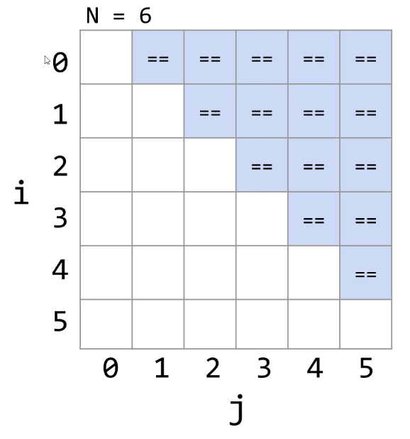
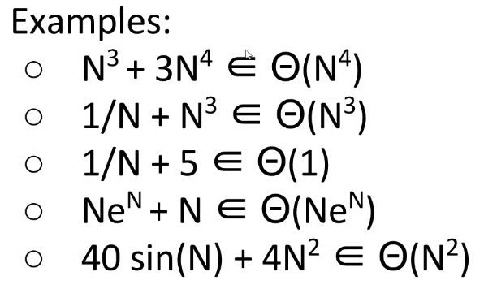
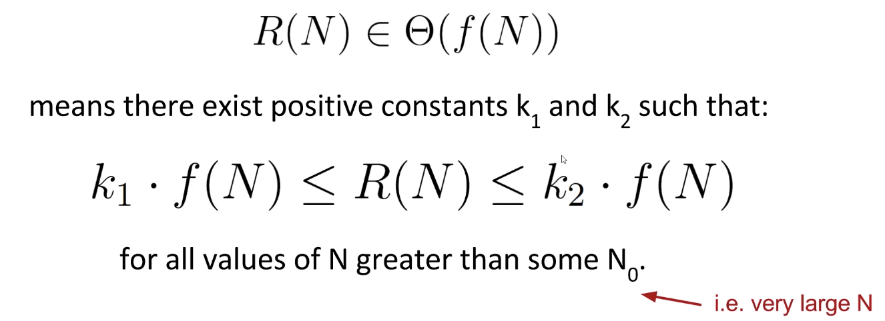
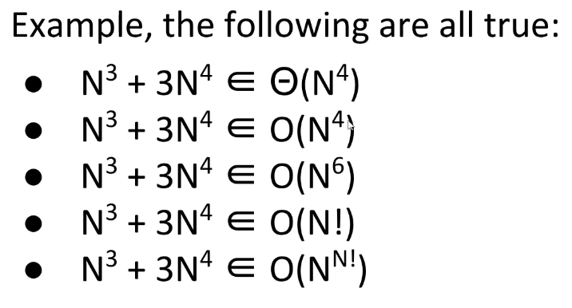
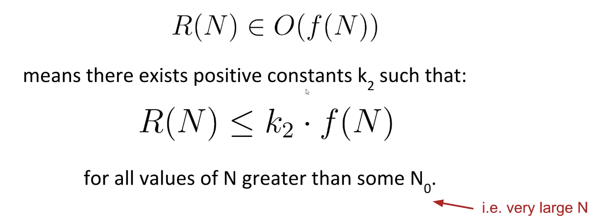

# Lecture 13: Asymptotics I
#### 9/26/2020

### 61B: Writing Efficient Programs
- An engineer will do for a dime what any fool will do for a dollar
- Execution cost (from today to the end of the course)
  - How much time does your program take to execute?
  - How much memory does your program require?

### Example of Algorithm Cost
- Objective: Determine if a sorted array contains any duplicates
  - Given sorted array A, are there indices i and j where `A[i] = A[j]`
- Silly algorithm: Consider every possible pair, returning true if any match
- Better algorithm:
  - For each number A[i], look at A[i+1], and return true the first time you see a match. If you run out of items, return false.


## Characterization 1 Clock Time

### How Do I Runtime Characterization?
- Our goal is to somehow **characterize the runtimes** of the different functions/algorithms
  - Characterization should be **simple** and **mathematically rigorous**
  - Characterization should **demonstrate superiority** of more efficient algorithms

### Techniques for Measuring Computational Cost
- Technique 1: Measure execution time in seconds using a client program
  - Tools:
    - Physical stopwatch
  - Good: Easy to measure, meaning is obvious
  - Bad: May require large amounts of computation time. Result varies with machine, compiler, input data, etc.

### Techniques for Measuring Computational Cost
- Technique 2A: Count possible operations for an array of size N = 10000
  - Good: Machine independent. Input dependence captured in model.
  - Bad: Tedious to compute. Array size was arbitrary. Doesn't tell you actual time.
- Technique 2B: Count possible operations in terms of input array size N
  - Good: Machine independent. Input dependence captured in model. Tells you how the algorithm **scales**
  - Bad: Even more tedious to compute. Doesn't tell you actual time.


## Why Scaling Matters

### Comparing Algorithms
- Good algorithms **scale better** in the worst case
- In the case of our two algorithms, parabolas (N^2) grow faster than lines (N)

### Asymptotic Behavior
- In most cases, we care only about asymptotic behavior, i.e. what happens for very large N
  - Simulation of billions of interacting particles
  - Social network with billions of users
  - Logging of billions of transactions
  - Encoding of billions of bytes of video data
- Algorithms which scale well (e.g. look like lines) have better asymptotic runtime behavior than algorithms that scale relatively poorly (e.g. look like parabolas)

### Parabolas vs. Lines
- Suppose we have two algorithms that zerpify a collection of N items
  - `zerp1` takes 2N^2 operations
  - `zerp2` takes 500N operations
- For small N, `zerp1` might be faster, but as dataset size grows, the parabolic algorithm is going to fall farther and farther behind (in time it takes to complete)

### Scaling Across Many Domains
- We'll informally refer to the "shape" of a runtime function as its **order of growth**
  - Effect is dramatic! Often determines whether a problem can be solved at all.


## Worst Case Orders of Growth

### Intuitive Simplification 1: Consider Only the Worst Case
- Simplification 1: Consider only the worst case
  - **Justification:** When comparing algorithms, we often care only about the worst case [but we will see exceptions in this course]

### Intuitive Simplification 2: Restrict Attention to One Operation
- Simplification 2: Pick some representative operation to act as a proxy for the overall runtime
- We call our choice the "**cost model**"

### Intuitive Simplification 3: Eliminate low order terms
- Simplification 3: Ignore lower order terms

### Intuitive Simplification 4: Eliminate multiplicative constants
- Simplification 4: Ignore multiplicative constants
  - Why? It has no real meaning. We already threw away information when we chose a single proxy operation

### Simplification Summary
- Simplifications:
  - Consider only the worst case
  - Pick a representative operation (aka the cost model)
  - Ignore lower order terms
  - Ignore multiplicative constants
- We only care about the **order of growth** of the runtime


## Simplified Analysis

### Simplified Analysis Process
- Rather than building the entire table, we can instead:
  - Choose a representative operation to count (aka cost model)
  - Figure out the order of growth for the count of the representative operation by either:
    - Making an exact count, then discarding the unnecessary pieces
    - Using intuition and inspection to determine order of growth

### Analysis of Nested For Loops (Based on Exact Count)
```
int N = A.length;
for (int i = 0; i < N; i += 1) {
    for (int j = i + 1; j < N; j += 1) {
        if (A[9] == A[j]) {
            return true;
        }
    }
}
return false
```
- Find the order of growth of the worst case runtime of `dup1`
- Worst case number of `==` operations

- `C = 1 + 2 + ... + (N-2) + (N-1) = N(N-1)/2`
- Worst case order of growth for `==` is N^2
- Worst case order of growth of runtime: N^2

### AnLysis of Nested For Loops (Simpler Geometric Argument)
- Find order of growth of the worst case runtime of `dup1`
- Worst case number of `==` operations:
  - Given by area of right triangle of side length N-1
  - Order of growth of area is N^2
- Operation `==` has worst case order of growth N^2
- Worst case order of growth of runtime: N^2

### Formalizing Order of Growth
- Given a function Q(N), we can apply our last two simplifications to yield the order of growth of Q(N)
- Let's finish this lecture by moving to a more formal notation called Big-Theta


### Big-Theta: Formal Definition


### Big-Theta and Runtime AnLysis
- Using Big-Theta doesn't change anything about runtime analysis
- The only difference is that we use the Theta symbol


## Big O Notation

### Big O
- Whereas Big Theta can be thought of like "equals", Big O can be thought of as "less than or equal"



### Big Theta vs. Big O
- Big Theta:
  - Order of growth is f(N)
- Big O:
  - Order of growth is less than or equal to f(N)

### Summary
- Given a code snippet, we can express its runtime as a function R(N) where N is some property of the input of the function (often the size of the input)
- Rather than finding R(N) exactly, we instead usually only care about the order of growth of R(N)
- One approach (not universal)
  - Choose a representative operation, and let C(N) be the count of how many times that operation occurs as a function of N
  - Determine order of growth f(N) for C(N)
    - Often (but not always) we consider the worst case count
  - If an operation takes constant time, then R(N) corresponds to C(N)
  - Can use O as an alternative for Big Theta. O is used for upper bounds.


## Summary From Discussion

### Aymptotics
- Asymptotics allow us to evaluate the performance of our programs using math. We ignore all constants and only care about the value with reference to the input (usually defined as N)
  - Big O - The upper found in terms of the input (essentially, assume every conditional statement evaluates to the worst case)
  - Big Omega - The lower bound in terms of the input (essentially, assume every conditional statement evaluates to the best case)
  - Big Theta - The tightest bound, which only exists when the tightest upper bound and the tightest lower bound converge to the same value