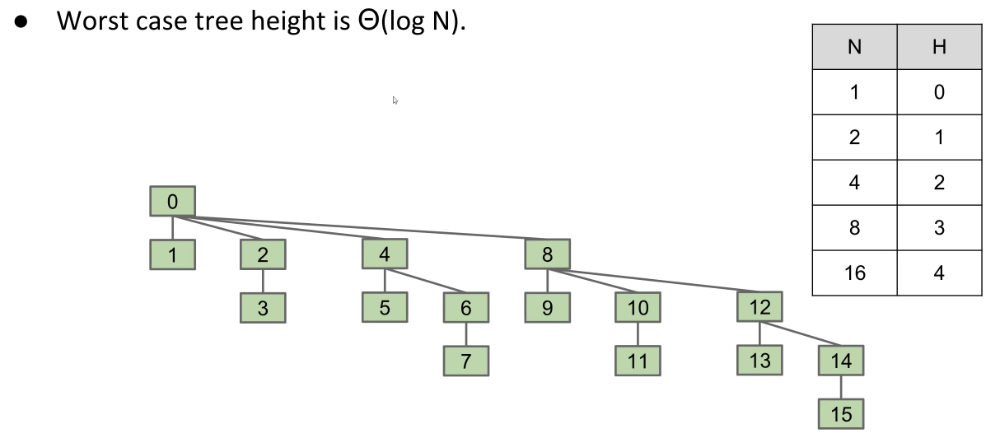
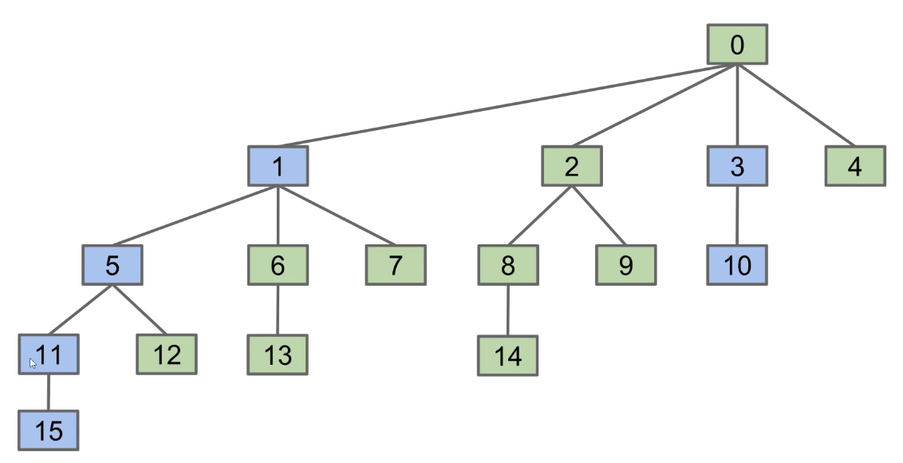
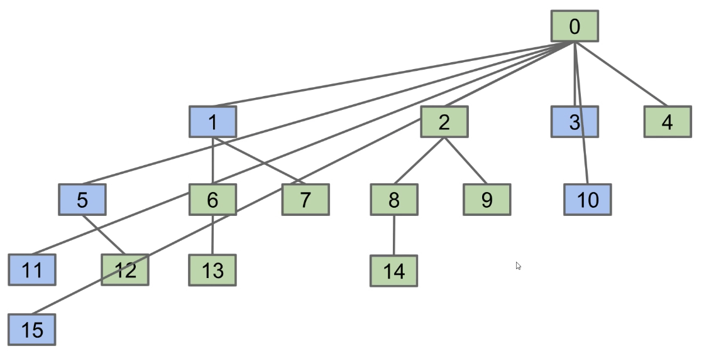

# Lecture 14: Disjoint Sets
#### 9/28/2020


## Intro to Disjoint Sets

### Meta-goals of the Coming Lectures: Data Structure Refinement
- Today: Deriving the "Disjoint Sets" data structure for solving the "Dynamic Connectivity" problem. We will see:
  - How a data structure design can evolve from basic to sophisticated
  - How our choice of underlying abstraction can affect asymptotic runtime and code complexity

### The Disjoint Sets Data Structure
- The Disjoint Sets data structure has two operations:
  - `connect(x, y)`: Connects x and y
  - `isConnected(x, y)`: Returns true if x and y are connected. Connections can be transitive, i.e. they don't need to be direct
- Useful for many purposes
  - Percolation theory:
    - Computational chemistry
  - Implementation of other algorithms
    - Kruskal's algorithm

### Disjoint Sets on Integers
- To keep things simple, we're going to:
  - Force all items to be integers instead of arbitrary data
  - Declare the number of items in advance, everything is disconnected at start

### The Disjoint Sets Interface
```
public interface DisjointSets {
    /** Connects two items P and Q */
    void connect(int p, int q);

    /** Checks to see if two items are connected */
    boolean isConnected(int p, int q);
}
```
- Goal: Design an efficient DisjointSets implementation
  - Number of elements N can be huge
  - Number of method calls M can be huge
  - Calls to methods may be interspersed (e.g. can't assume it's only connect operations followed by only isConnected operations)

### The Naive Approach
- Naive approach:
  - Connect two things: Record every single connecting line in some data structure
  - Checking connectedness: Do some sort of iteration over the lines to see if one thing can be reached from the other

### A Better Approach: Connected Components
- Rather than manually writing out every single connecting line, only record the sets that each item belongs to
- For each item, its **connected component** is the set of all items that are connected to that item
- Better approach: Model connectedness in terms of sets
  - How things are connected isn't something we need to know
  - Only need to keep track of which connected component each item belongs to


## Quick Find

### Performance Summary
- ListOfSetsDS
  - Constructor: Theta(N)
  - Connect: Theta(N)
  - isConnected: O(N)
- ListofSetsDS is complicated and slow
  - Operations are linear when number of connections are small
    - Have to iterate over all sets
  - Important point: By deciding to use List of Sets, we have doomed ourselves to complexity and bad performance

### My Approach: Just use a list of integers
- Idea #2: List of integers where ith entry gives set number (aka "id") of item i
  - `connect(p, q)`: Change entries that equal `id[p]` and `id[q]`
- QuickFindDS
  - Constructor: Theta(N)
  - Connect: Theta(N)
  - isConnected: Theta(1)


## Quick Union

### Improving the Connect Operation
- Next approach (Quick Union): We will still represent everything as connected components, and we will still represent connected components as a list of integers. However, values will be chosen so that connect is fast
- How could we change our set representation so that combining two sets into their union requires changing **one** value?
  - Idea: Assign each item a parents (instead of an id). Results in a tree-like shape
  - An innocuous sounding, seemingly arbitrary solution
- Ex: `connect(5, 2)`
  - Find `root(5)`
  - Find `root(2)`
  - Set `root(5)`'s value equal to `root(2)`

### Set Union Using Rooted-Tree Representation
- What are some potential performance issues with this approach
  - Tree can get too tall! `root(x)` becomes expensive
  - For N items, this means a worst case runtime of Theta(N)
- QuickUnionDS
  - Constructor: Theta(N)
  - Connect: O(N)
  - isConnected: O(N)
- QuickUnion defect: Trees can get tall. Results in potentially even worse performance than QuickFind if tree is imbalanced
  - Observation: Things would be fine if we just kept our tree balanced


## Weighted Quick Union

### Weighted Quick Union
- Modify quick-union to avoid tall trees
  - Track tree size (number of elements)
  - New rule: Always link root of **smaller** tree to **larger** tree
  - Note: this rule is based on **weight**, not height

### Implementing WeightedQuickUnion
- Minimal changes needed
  - Use parent[] array as before
  - `isConnected(int p, int q)` requires no changes
  - `connect(int p, int q)` needs to somehow keep track of sizes
    - Two common approaches:
      - Use values other than -1 in parent array for root nodes to track size
      - Create a separate size array

### Weighted Quick Union Performance
- Consider the worst case where the tree height grows as fast as possible
  - The height increases logarithmically with respect to the number of elements
  - Worst case tree height is Theta(log N)


### Performance Summary
- WeightedQuickUnionDS
  - Constructor: Theta(N)
  - Connect: O(log N)
  - isConnected(log N)
- QuickUnion's runtimes are O(H), and WeightedQuickUnionDS height is given by H = O(log N). THerefore connect and isConnected are both O(log N)
- By tweaking QuickUnionDS we've achieved logarithmic time performance

### Why Weights Instead of Heights?
- We used the number of items in a tree to decide upon the root
  - Why not use the height of the tree?
    - Worst case performance for HeightedQuickUnionDS is asymptotically the same! Both are Theta(log N)
    - Resulting code is complicated with no performance gain


## Path Compression (CS 170 Spoiler) (Can we do better?)

### What We've Achieved
- Performing M operations on a DisjointSet object with N elements:
  - For our naive implementation, runtime is O(MN)
  - For our best implementation, runtime is O(N + M log N)
  - Key point: Good data structure unlocks solutions to problems that could otherwise not be solved!
  - Good enough for all practical uses, but could we theoretically do better?

### CS 170 Spoiler: Path Compression: A Clever Idea
- Below is the topology of the worst case if we use WeightedQuickUnion
  - Clever Idea: When we do isConnected(15, 10), tie all nodes seen to the root
    - Additional cost is insignificant (same order of growth)




- Path compression results in a union/connected operations that are very very close to amortized constant time
  - M operations on N nodes is O(N + M lg* N) - you will see this in CS 170
  - lg* is less than 5 for any realistic input
  - A tighter bound: O(N + M \alpha(N)), where \alpha is the inverse Ackermann function
  - The inverse Ackermann function is less than 5 for all practical inputs!

### A Summary of Our Iterative Design Process
- And we're done! The end result of our iterative design process is the standard way disjoint sets are implemented today - quick union and path compression
- The ideas that made our implementation efficient:
  - Represent sets as connected components (don't track individual connections)
    - **ListofSetsDS**: Store connected components as a List of Sets (slow, complicated)
    - **QuickFindDS**: Store connected components as set ids
    - **QuickUnionDS**: Store connected components as parent ids
      - **WeightedQuickUnionDS**: Also track the size of each set, and use size to decide on a new tree root
        - **WeightedQuickUnionWithPathCompressionDS**: On calls to connect and isConnected, set parent id to the root for all items seen


## Summary From Discussion

### Disjoint Sets
- **QuickFind** uses an array of integers to track which set each element belongs to
- **QuickUnion** stores the parent of each node rather than the set to which it belongs sto and merges sets by setting the parent of one root to the other
- **WeightedQuickUnion** does the same as QuickUnion except it decides which set is merged into which by size, reducing the likelihood of large trees
- **WeightedQuickUnion with Path Compression** sets the parent of each node to the set's root whenever `find()` is called on it