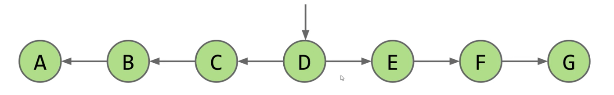
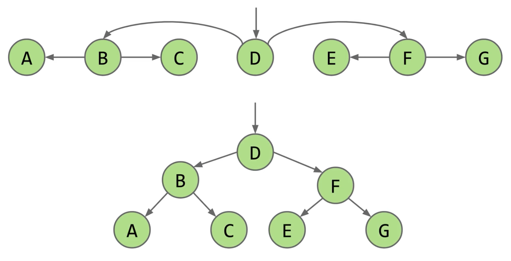

# Lecture 16: ADTs, Sets, Maps, Binary Search Trees
#### 10/2/2020

## Abstract Data Types

### Abstract Data Types (ADT)
- An **Abstract Data Type (ADT)** is defined only by its operations, not by its implementation
- Deque ADT:
  - addFirst
  - addLast
  - isEmpty
  - size
  - printDeque
  - removeFirst
  - removeLast
  - get

### Another example of an ADT: The Stack
- The Stack ADT supports the following operations
  - push(int x): Puts x on top of the stack
  - int pop(): Removes and returns the top item from the stack
- Which implementation do you think would result in faster overall performance?
  - Linked List
  - Array
- Both are about hte same. No resizing for linked lists, so probably a little faster

### GrabBag ADT
- The GrabBag ADT supports the following operations:
  - insert(int x): Inserts x into the grab bag
  - int remove(): Removes a random item from the bag
  - int sample(): Samples a random item from the bag
  - int size(): Number of items in the bag
- In this case, Array will result in faster performance than Linked List

### Abstract Data Types in Java
- Syntax differentiation between abstract data types and implementations
  - Interfaces in Java aren't purely abstract and can contain some implementation details, e.g. default methods
- Example: `List<Integer> L = new ArrayList<>();`

### Collections
- Among the most important features in java.util library are those that extend the Collection interface
  - Lists of things
  - Sets of things
  - Mappings between items
    - Maps also known as associate arrays, associative lists, symbol tables, dictionaries

### Java Libraries
- The built-in java.util package provides a number of useful:
  - Interfaces: ADTs (lists, sets, maps, priority queues, etc)
  - Implementations: Concrete classes you can use


## Binary Search Trees

### AnLysis of an OrderedLinkedListSet<Character>
- We implemented a set based on unordered arrays. For the **order linked list** set implementation, name an operation that takes worst case linear time, i.e. Theta(N)
  - Both `contains` and `add` will take linear time

### Optimization: Extra Links
- Fundamental Problem: Slow search, even though it's in order
  - Add (random) express lanes. Skip List (won't discuss in 61B)

### Optimization: Change the Entry Point
- Fundamental Problem: Slow search, even though it's in order
  - Move pointer to middle and flip left links. Halved search time!

  - How do we do even better?



## BST Definitions

### Tree
- A tree consists of
  - A set of nodes
  - A set of edges that connect those nodes
    - Constraint: There is exactly one path between any two nodes

### Rooted Trees and Rooted Binary Trees
- In a rooted tree, we call one node the root
  - Every node N except the root has exactly one parent, defined as the first node on the path from N to the root
  - A node with no child is called a leaf
- In a rooted binary tree, every node has either 0, 1, or 2 children (subtrees)

### Binary Search Trees
- A binary search tree is a rooted binary tree with the BST property
- **BST Property**. For every node X in the tree
  - Every key in the **left** subtree is **less** than X's key
  - Every key in the **right** subtree is **greater** than X's tree
- Ordering must be complete, transitive, and antisymmetric. Given keys p and q:
  - Exactly one of p < q and q < p are true
  - p < q and q < r implies p < r
- One consequence of these rules: No duplicate keys allowed!
  - Keep things simple. Most real world implementations follow this rule


## BST Operations: Search

### Finding a searchKey in a BST
- If searchKey returns T.key, return
  - If searchKey < T.key, search T.left
  - If searchKey > T.key, search T.right

```
static BST find(BST T, key sk) {
    if (T == null)
        return null;
    if (sk.equals(T.key))
        return T;
    else if (sk < T.key)
        return find(T.left, sk);
    else
        return find(T.right, sk);
}
```

- What is the runtime to complete a search on a "bushy" BST in the worst case, where N is the number of nodes?
  - Answer is Theta(log N)
  - Height of the tree is ~log_2(N)

### BSTs
- Bushy BSTs are extremely fast
- Much computation is dedicated towards finding things in response to queries
  - It's a good thing that we can do such queries almost for free


## BST Operations: Insert

### Inserting a new key into a BST
- Search for key
  - If found, do nothing
  - If not found
    - Create a new node
    - Set appropriate link

```
static BST insert(BST T, Key ik) {
    if (T == null)
        return new BST(ik);
    if (ik < T.key)
        T.left = insert(T.left, ik);
    else if (ik > T.key)
        T.right = insert(T.right, ik);
    return T;
}
```


## BST Operation: Delete

### Deleting from a BST
- 3 Cases:
  - Deletion key has no children
  - Deletion key has one child
  - Deletion key has two children

### Case 1: Deleting from a BST: Key with no Children
- Deletion key has no children
  - Just sever hte parent's link
  - Garbage collected

### Case 2: Deleting from a BST: Key with one Child
- Goal: Maintain BST property
  - Key's child definitely larger than parent
    - Safe to just move that child into key's spot
- Thus: Move key's parent's pointer to key's child
  - Key will be garbage collected (along with its instance variables)

### Case 3: Deleting from a BST: Deletion with two Children
- Goal:
  - Find a new root node
  - Must be > than everything in left subtree
  - Must be < than everything in right subtree
- Choose either predecessor or successor
  - Delete predecessor (the largest key smaller than the removed key) or successor (the smallest key larger than the removed key), and stick new copy in the root position
    - This deletion guaranteed to be either case 1 or 2
  - This strategy is sometimes known as "Hibbard deletion"


## Sets vs. Maps, Summary

### Sets vs. Maps
- Can think of the BST as representing a Set
- But what if we wanted to represent a mapping of word counts?
- To represent maps, just have each BST node store key/value pairs
- Note: No efficient way to look up by value
  - Example: Cannot find all the keys with value = 1 without iterating over ALL nodes. This is fine.

### Summary
- Abstract data types are defined in terms of operations, not implementation
- Several useful ADTs: Disjoint Sets, Map, Set, List
  - Java provides Map, Set, List interfaces, along with several implementations
- We've seen two ways to implement a Set (or Map): ArraySet and using a BST
  - ArraySet: Theta(N) operations in the worst case
  - BST: Theta(log N) operations if tree is balanced
- BST implementations:
  - Search and insert are straightforward (but insert is a little tricky)
  - Deletion is more challenging. Typical approach is "Hibbard deletion"


## BST Implementation Tips

### Tips for BST Lab
- Code from class was "naked recursion". Your BSTMap will not be
- For each public method, e.g. put(K key, V value), create a private recursive method, e.g. put(K key, V value, Node n)
- When inserting, always set left/right pointers, even if nothing is actually changing
- Avoid "arms length base cases". Don't check if left or right is null!


## CSM Review
- A **list** is an ordered sequence of items: like an array, but without worrying about the length or size
```
interface List<E> {
  boolean add(E element);
  void add(int index, E element);
  E get(int index);
  int size();
}
```
- Maps (Dictionary)
  - Notes:
    - Keys are unique
    - Values don't have to be unique
    - Key lookup: O(1)
  - A **map** is a collection of key-value mappings, like a dictionary in Python
  - Like a set, the keys in a map are unique
```
interface Map<K, V> {
  V put(K key, V value);
  V get(K key);
  boolean containsKey(Object key);
  Set<K> keySet();
}
```
- Sets
  - Notes:
    - Unordered collection of *unique* items
    - Set operations are O(1)
  - A **set** is an unordered collection of unique elements
```
interface Set<E> {
  boolean add(E element);
  boolean contains(Object object);
  int size();
  boolean remove(Object object);
}
```
- Stacks and Queues
  - Stack
    - "First in Last out"
  - Queue
    - "First in First out"