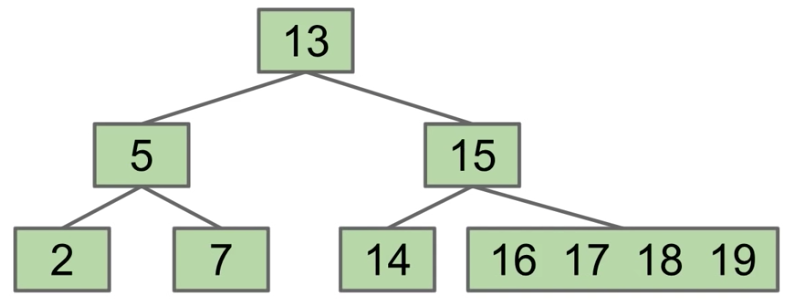
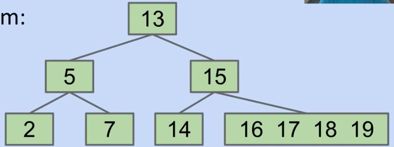
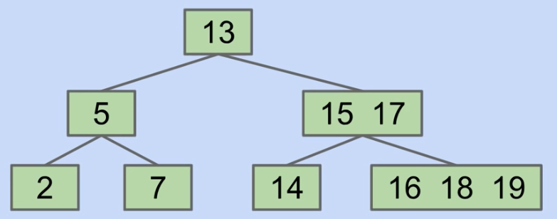
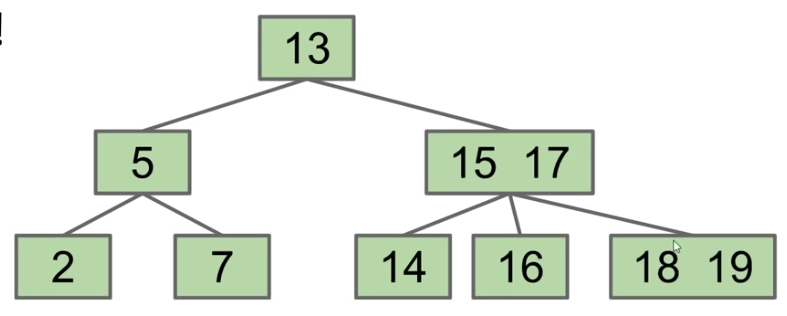
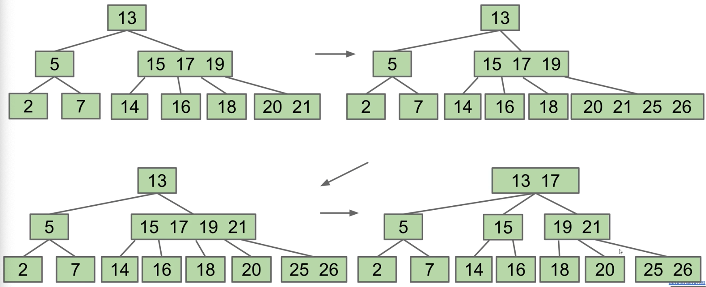
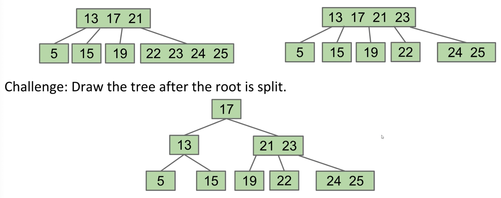

# Lecture 17: B-Trees (2-3, 2-3-4 Trees)
#### 10/5/2020

## BST Tree Height

### BST Tree Height
- Trees range from best-case "bushy" to worst-case "spindly"
  - Height varies dramatically among the two
    - Theta(log N) for bushy vs Theta(N) for spindly
- Performance of operations on spindly trees can be just as bad as a linked list!
- A worst case (spindly tree) has a height that grows exactly linearly - Theta(N)
- A best case (bushy tree) has a tree height that grows exactly logarithmically - Theta(log N)

### The Usefulness of Big O
- Big O is a useful idea:
  - Allows us to make simple blanket statements, e.g. can just say "binary search is O(log N)" instead of "binary search is Theta(log N) in the worst case"
  - Sometimes don't know the exact runtime, so use O to give an upper bound
    - Example: Runtime for finding shortest route that goes to all world cities is O(2^N). There might be a faster way, but nobody knows one yet
  - Easier to write proofs for Big O than Big Theta, e.g. finding runtime of mergesort, you can round up the number of items to the next power of 2. A little beyond the scope of the course.

## Height, Depth, and Performance

### Height and Depth
- Height and average depth are important properties of BSTs
  - The **"depth" of a node** is how far it is from the root
    - The root has depth 0
  - The **"height" of a tree** is the depth of its deepest leaf
  - The **"average depth"** of a tree is the average depth of a tree's nodes

### Height, Depth, and Runtime
- Height and average depth determine runtimes for BST operations
  - The **"height"** of a tree determines the worst case runtime to find a node
  - The **"average depth"** determines the average case runtime to find a node

### Important Question: What about real world BSTs?
- BSTs have:
  - Worst case Theta(N) height
  - Best case Theta(log N) height
- One way to approximate real world BSTs is to consider randomized BSTs
- **Nice Property**. Random trees have Theta(log N) average depth and height
  - In other words: Random trees are bushy, not spindly

### Randomized Trees: Mathematical Analysis
- **Average Depth**. If N distinct keys are inserted into a BST, the expected average depth is ~ 2 ln N
  - Thus, average runtime for contains operation is Theta(log N) on a tree built with random inserts
- **Tree Height**. If N distinct keys are inserted in random order, expected tree height is ~ 4.311 ln N
  - Thus, worst case runtime for contains operation is Theta(log N) on a tree built with random inserts
- BSTs have:
  - Worst case Theta(N) height
  - Best case Theta(log N) height
  - Theta(log N) height if constructed via random inserts
- In real world applications we expect both insertion and deletion
  - Can show that random trees including deletion are still Theta(log N) height

### Good News and Bad News
- Good news: BSTs have great performance if we insert items randomly
  - Performance is Theta(log N) per operation
- Bad news: We can't always insert our items in a random order
  - Data comes in over time, don't have all at once

## B-trees / 2-3 trees / 2-3-4 trees

### Avoiding Imbalance through Overstuffing
- The problem is adding new leaves at the bottom
- Crazy idea: never add new leaves at the bottom
  - Tree can never get imbalanced
- Avoid new leaves by "overstuffing" the leaf nodes
  - "Overstuffed tree" always has balanced height, because leaf depths never change
- Overstuffed trees are a logically consistent but very weird data structure

  - contains(18):
    - 18 > 13? Yes, go right
    - 18 > 15? Yes, go right
    - 16 = 18? No
    - 17 = 18? No
    - 18 = 18? Yes! Found it
  - Problem with this idea? Degenerates into linked list

### Revising Our Overstuffed Tree Approach: Moving Items Up
- Height is balanced, but we have a new problem
  - Leaf nodes can get too juicy
- Solution?
  - Set a limit L on the number of items, say L=3
  - If any node has more than L items, give an item to parent
    - Which one? Let's say (arbitrarily) the left-middle
- What's the problem now?
  - 16 is to the right of 17

### Revising Overstuffed Tree Approach: Node Splitting
- Solution?
  - Set a limit L on the number of items, say L=3
  - If any node has more than L items, give an item to parent
    - Pulling item out of full node splits it into left and right
    - Parent node now has three children!

- This is a logically consistent and not so weird data structure
  - Contains(18):
    - 18 > 13, so go right
    - 18 > 15, so compare vs. 17
    - 18 > 17, so go right
- Examining a node costs us O(L) compares, but that's OK since L is constant
- What if a non=leaf node gets too full? Can we split that?

### add: Chain Reaction
- Suppose we add 25, 26:

### What Happens if the root is too full?

### Perfect Balance
- Observation: Splitting-trees have perfect balance
  - If we split the root, every node gets pushed down by exactly one level
  - If we split a leaf or internal node, the height doesn't change
- All operations have guaranteed O(log N) time

### THe Real Name for Splitting Trees is "B Trees"
- B-trees of order L=3 (like we used today) are also called a 2-3-4 tree or a 2-4 tree
  - "2-3-4" refers to the number of children that a node can have
- B-trees of order L=2 are also called a 2-3 tree
- B-Trees are most popular in two specific contexts:
  - Small L(L=2 or L=3)
    - Used as a conceptually simple balanced search tree
  - L is very large (say thousands)
    - Used in practice for databases and file systems

## B-tree Bushiness Invariants

### Exercise
- No matter the insertion order you choose, resulting B-Tree is always bushy!
  - May vary in height a little bit, but overall guaranteed to be bushy

### B-Tree Invariants
- Because of the way B-Trees are constructed, we get two nice invariants
  - All leaves must be the same distance from the source
  - A non-leaf node with k items must have exactly k+1 children
- These invariants guarantee that our tree will be bushy

## B-Tree Runtime Analysis

### Height of a B-Tree with Limit L
- L: Max number of items per node
- Height: Between ~log_{L+1}(N) and ~log_2(N)
  - Largest possible height is all non-leaf nodes have 1 item
  - Smallest possible height is all nodes have L items
  - Overall height is therefore Theta(log N)

### Runtime for `contains`
- Runtime or contains:
  - Worst case number of nodes to inspect: H + 1
  - Worst case number of items to inspect per node: L
  - Overall runtime: O(HL)
- Since H = Theta(log N), overall runtime is O(L log N)
  - Since L is a constant, runtime is therefore O(log N)
- Bottom line: contains and add are both O(log N)

## Summary

### Summary
- BSTs have best case height Theta(log N) and worst case height Theta(N)
  - Big O is not the same thing as worst case
- B-Trees are a modification of the binary search tree that avoids Theta(N) worst case
  - Nodes may contain between 1 and L items
  - `contains` works almost exactly like a normal BST
  - `add` works by adding items to existing leaf nodes
    - If nodes are too full, they split
  - Resulting tree has perfect balance. Runtime for operations is O(log N)
  - Have not discussed deletion
  - Have not discussed how splitting works if L > 3
  - B-trees are more complex, but they can efficiently handle ANY insertion order
