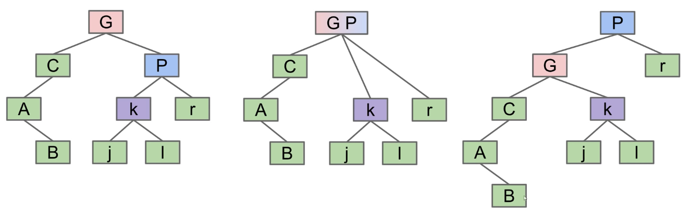
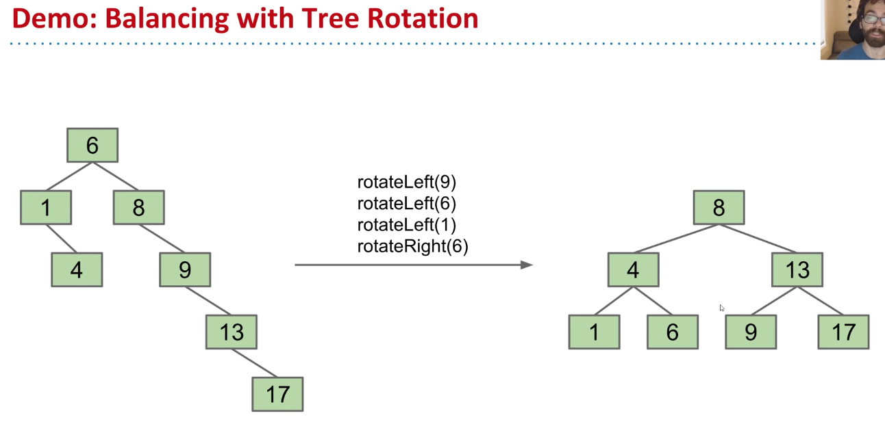
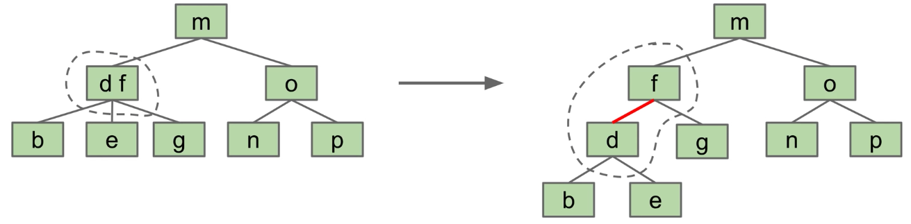
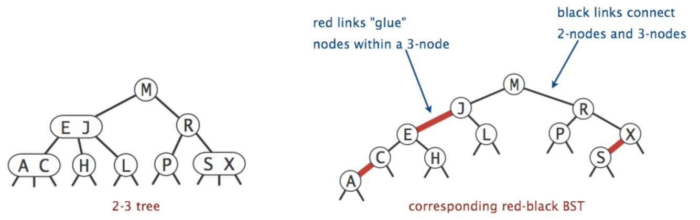

# Lecture 18: Red Black Trees
#### 10/7/2020

### The Bad News
- 2-3 trees (and 2-3-4 trees) are a real pain to implement, and suffer from performance problems. Issues include:
  - Maintaining different node types
  - Interconversion of nodes between 2-nodes and 3-nodes
  - Walking up the tree to split nodes

## BST Structure and Tree Rotation

### BSTs
- Suppose we have a BST with the numbers 1, 2, 3. Five possible BSTs
  - The specific BST you get is based on the insertion order
  - More generally, for N items, there are Catalan(N) different BSTs
- Given any BST, it is possible to move to a different configuration using "rotation"
  - In general, can move from any configuration to any other in 2n - 6 rotations

### Tree Rotation Definition
- rotateLeft(G): Let x be the right child of G. Make G the **new left child** of x
  - Preserves search tree property. No change to semantics of tree
  - Can think of as temporarily G and P, then sending G down and **left**

- rotateRight(P): Let x be the left child of P. Make P the **new right child** of x
  - Can think of as temporarily merging G and P, then sending P down and **right**

### Rotation for Balance
- Rotation:
  - Can shorten (or lengthen) a tree
  - Preserves search tree property

### Rotation: An Alternate Approach to Balance
- Rotation:
  - Can shorten (or lengthen) a tree
  - Preserves search tree property
- Paying O(n) to occasionally balance a tree is not ideal. In this lecture, we''l see a better way to achieve balance through rotation

## Red-Black Trees

### Search Trees
- There are many types of search trees:
  - **Binary search trees**: Can balance using rotation, but we have no algorithms for doing so (yet)
  - **2-3 trees**: Balanced by construction, i.e. no rotations required
- Let's try something clever, but strange
- Our goal: Build a BST that is structurally identical to a 2-3 tree
  - Since 2-3 trees are balanced, so will our special BSTs.

### Representing a 2-3 Tree as a BST
- A 2-3 tree with only 2-nodes is trivial
  - BST is exactly the same!
- What do we do about 3-nodes?
  - Possibility 1: Create dummy "glue" nodes
    - Result is inelegant. Wasted link. Code will be ugly
  - Possibility 2: Create "glue" links with the smaller item off to the left
    - Idea is commonly used in practice

### Left-Leaning Red Black Binary Search Tree (LLRB)
- A BST with left glue links that represent a 2-3 tree is often called a 
"Left Leaning Red Black Binary Search Tree" or LLRB
  - LLRBs are normal BSTs
  - There is a 1-1 correspondence between an LLRB and an equivalent 2-3 tree
  - The red is just a convenient fiction. Red links don't "do" anything special

## Red Black Tree Properties

### Left-Leaning Red Black Binary Search Tree (LLRB)
- Searching an LLRB tree for a key is easy
  - Treat it exactly like any BST

### Left-Leaning Red Black Binary Search Tree (LLRB) Properties
- Some handy LLRB properties:
  - No node has two red links [otherwise it'd be analogous to a 4 node, which are disallowed in 2-3 trees]
  - Every path from root to a leaf has same number of **black links** [because 2-3 trees have the same number of links to every leaf]. LLRBs are therefore balanced
  - Logarithmic height

### LLRB Construction
- Where do LLRBs come from?
  - Would not make sense to build a 2-3 tree, then convert it
  - Instead, it turns out we implement an LLRB insert as follows:
    - Insert as usual into a BST
    - Use zero or more rotations to maintain the 1-1 mapping

## Maintaining 1-1 Correspondence Through Rotations

### The 1-1 Mapping
- There exists a 1-1 mapping between:
  - 2-3 Tree
  - LLRB
- Implementation of an LLRB is based on maintaining this 1-1 correspondence
  - When performing LLRB operations, pretend like you're a 2-3 tree
  - Preservation of the correspondence will involve tree rotations

### Design Task 1: Insertion Color
- Always use a red link when adding onto a leaf

### Design Task 2: Insertion on the Right
- Right links aren't allowed, so rotateLeft
- Likewise, left links aren't allowed, so rotateRight

### New Rule: Representation of Temporary 4-Nodes
- We will represent temporary 4-nodes as BST nodes with two red links
  - This state is only temporary, so temporary violation of "left leaning" is ok

### Design Task 3: Double insertion on the left
- When double inserting on the left, rotate the node to the right

### Design Task 4: Splitting Temporary 4-nodes
- Suppose we have the LLRB includes a temporary 4 node
  - To fix this, flip the colors of all edges touching the node
    - Note: This doesn't change the BST structure/shape

### That's it!
- We've just invented the red-black BST
  - When inserting: Use a red link
  - If there is a right leaning "3-node", we have a **Left Leaning Violation**
    - Rotate left the appropriate node to fix
  - If there are two consecutive left links, we have an **Incorrect 4 Node VIolation**
    - Rotate right the appropriate node to fix
  - If there are any nodes with two red children, we have a **Temporary 4 Node**
    - Color flip the node to emulate the split operation
- Cascading operations
  - It is possible that a rotation or flip operation will cause an additional violation that needs fixing

## LLRB Runtime and Implementation

### LLRB Runtime
- The runtime analysis for LLRBs is simple if you trust the 2-3 tree runtime
  - LLRB tree has height O(log N)
  - Contains is trivially O(log N)
  - Insert is O(log N)
    - O(log N) to add the new node
    - O(log N) rotation and color flip operations per insert
- We will not discuss LLRB delete
  - Not too terrible really, but it's just not interesting enough to cover. See optional textbook if you're curious

### LLRB Implementation
- Amazingly, turning BST into an LLRB requires only 3 clever lines of code
  - Does not include helper methods (which do not require cleverness)

## Search Tree Summary

### Search Tree
- In the last 3 lectures, we talked about using search trees to implement sets/maps
  - Binary search trees are simple, but they are subject to imbalance
  - 2-3 Trees (B Trees) are balanced, but painful to implement and relatively slow
  - LLRBs insertion is simple to implement (but delete is hard)
    - Works by maintaining mathematical bijection with a 2-3 trees
  - Java's TreeMap is a red-black tree (not left leaning)
    - Maintains correspondence with 2-3-4 tree (is not a 1-1 correspondence)
    - Allows glue links on either side
    - More complex implementation, but significantly faster
- There are many other types of search trees out there
  - Other self balancing trees: AVL trees, splay trees, treaps, etc.
- There are other efficient ways to implement sets and maps entirely
  - Other linked structures: Skip lists are linked lists with express lanes
  - Other ideas entirely: Hashing is the most common alternative. We'll discuss this idea in the next lecture

## CSM Review

### B-Trees
- B is for balanced
- Some definitions:
  - **depth** of a node is distance to the root (the root node has depth 0)
  - **height** of a tree is the depth of the lowest leaf
- Purpose of B-trees:
  - Avoids spindly trees
  - Keeps the tree with height log(n)

### 2-3 Trees
- Each non-leaf node can have 2 or 3 children
- Each node can be stuffed with at most 2 values
  - Once a node is overstuffed (aka 3 values), push middle value up

### 2-3-4 Trees
- Same idea as 2-3 trees, but now nodes can have 2, 3, or 4 children
- A node is overstuffed if it has 4 values
- Push up left-middle node

### Traversals
- **Level-Order Traversals**: Nodes are visited top-to-bottom, left-to-right
- **Depth-First Traversals**: Visit deep nodes before shallow ones
- In-order Traversal: LFR - "Left, Functionality, Right"
  - In a BST, this produces a sorted list of nodes in the tree (an in-order traversal that is "depth-first search")

### Rotating Nodes
- Imagine a circle around the node you rotate around and its child nodes
- "Pull" everything around in the direction you want to rotate
- Rotations do not change the in-order traversal

### Left-Leaning Red Black Trees
- A **binary** search tree
- Has a 1-1 correlation with 2-3 trees
  - Values that are stuffed into one node are now connected with red links
- Invariant: all red edges lean to the left
  - Fix by rotation/color swap
- Insert nodes with a red link (in a 2-3 tree we stuff values in a leaf node)

### Tree Traversals
- Depth First Search means we visit each subtree in some order recursively
  - Usually done with a stack
  - Pre Order
    - visit self, visit left, visit right
    - visit parent node before visiting child nodes
  - Post Order
    - visit left, visit right, visit self
    - visit left child, then parent, then right child
    - Can be done with a stack
  - In Order
    - visit left, visit self, visit right
    - visit child nodes before visiting parent nodes
- Level Order (Breadth First Search)
  - Visit in order of tree levels
  - Iterative search!
  - Usually done with a queue
