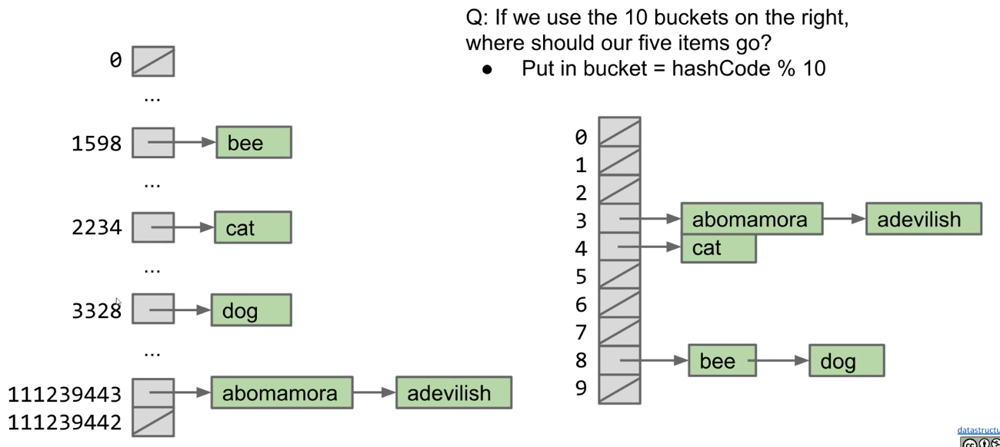

# Lecture 20: Hash Tables
#### 10/12/2020

## Data Indexed Arrays

### Limits of Search Tree Based Sets
- Our search tree sets require items to be comparable
  - Need to be able to ask "is X < Y?" Not true of all types
  - Could we somehow avoid the need for objects to be comparable
- Search tree sets have excellent performance, but could maybe be better
  - Could we somehow do better than Theta(log N)?

### Using Data as an Index
- One extreme approach: Create an array of booleans indexed by data!
  - Initially all values are false
  - When an item is added, set the appropriate index to true
    - i.e. 1F 2F 3T 4F 5F 6T 7F 8F ... is a set containing 3 and 6

```
public class DataIndexedIntegerSet {
    private boolean[] present;

    public DataIndexedIntegerSet() {
        present = new boolean[2000000000];
    }

    public add(int i) {
        present[i] = true;
    }

    public contains(int i) {
        return present[i];
    }
}
```
- Everything runs in constant time
- Downsides of this approach:
  - Extremely wasteful of memory. To support checking presence of all positive integers
  - Need some way to generalize beyond integers


## DataIndexedEnglishWordSet

### Generalizing the DataIndexedIntegerSet Idea
- Ideally, we want a data indexed set that can store arbitrary types
- The previous idea only supports integers!
  - Let's talk about storing Strings. We'll go into generics later
- Suppose we want to add ("cat")
- The key question:
  - What is the cat'th element of a list?
  - One idea: Use the first letter of the word as an index
- What's wrong with this approach?
  - Other words start with c
    - contains("chupacabra"): true ("chupacabra" collides with "cat")
  - Can't store "=98tu4it92"

### Avoiding Collisions
- Use all digits by multiplying each by a a power of 27
  - Thus, the index of "cat" is (3 x 27^2) + (1 x 27^1) + (20 x 27^0) = 2234
- Why this specific pattern?
  - Let's review how numbers are represented in decimal

### THe Decimal Number System vs. Our Own System for Strings
- In the decimal number system, we have 10 digits
- Want numbers larger than 9? Use a sequence of digits
- Our system for strings is almost the same, but with letters

### Uniqueness
- As long as we pick a base >= 26, this algorithm is guaranteed to give each lowercase English word a unique number!
  - Using base 27, no words will get the number 1598
- In other words: Guaranteed that we will never have a collision

```
public class DataIndexedEnglishWordSet {
    private boolean[] present;

    public DataIndexedEnglishWordSet() {
        present = new boolean[2000000000];
    }

    public add(String s) {
        present[englishToInt(s)] = true;
    }

    public contains(String s) {
        return present[englishToInt(s)];
    }
}
```


## DataIndexedStringSet

### DataIndexedStringSet
- Using only lowercase English characters is too restrictive
  - To understand what value we need to use for our base, let's discuss briefly the ASCII standard
  - Maximum possible value for english-only text including punctuation is 126, so let's use 126 as our base in order to ensure unique values for possible strings

### ASCII Characters
- THe most basic character set used by most computers is ASCII format
  - Each possible character is assigned a value between 0 and 127
  - Characters 33-126 are "printable", and are shown below
  - For example, `char c = 'D'` is equivalent to `char c = 68`

### Implementing asciiToInt
- The corresponding integer conversion function is actually even simpler than `englishToInt`. Using the raw character value means we avoid the need for a helper method

### Going Beyond ASCII
- chars in Java also support character sets for other languages like Chinese
  - This encoding is known as Unicode. Table is too big to list

### Example: Computing Unique Representations of Chinese
- The largest possible value for chinese characters is 40959, so we'd need to use this as our base if we want to have a unique representation for all possible strings of Chinese characters


## Integer Overflow and Hash Codes

### Major Problem: Integer Overflow
- In Java, the largest possible integer is 2147483647
  - If you go over this limit, you overflow, starting back over at the smallest integer, which is -2147483647

### Consequence of Overflow: Collisions
- Because Java has a maximum integer, we won't get the numbers we expect
  - With base 126, we will run into overflow even for short strings
    - Example: omens = 28196917171, which is much greater than the maximum integer
- Overflow can result in collisions, causing incorrect answers

### Hash Codes and the Pigeonhole Principle
- The official term for the number we're computing is "hash code"
  - A has code "projects a value from a set with many (or even an infinite number of) members to a value from a set with a fixed number of (fewer) members"
  - Here, our target set is the set of Java integers, which is of size 4294967296
- Pigeonhole principle tells us that if there are more than 4294967296 possible items, multiple items will share the same hash code
- Hence, collisions are inevitable

### Two Fundamental Challenges
- Two Fundamental Challenges
  - How do we resolve hashCode collisions
    - We'll call this **collision handling**
  - How do we compute a hash code for arbitrary objects?
    - We'll call this **computing a hashCode**


## Hash Tables: Handling Collisions

### Resolving Ambiguity
- Pigeonhole principle tells us that collisions are inevitable due to integer overflow
- Suppose N items have the same numerical representation h:
  - Instead of storing true in position h, store a "bucket" of these N items at position h
- How to implement a "bucket"?
  - Any type of list or set or data structure

### The Separate Chaining Data Indexed Array
- Each bucket in our array is initially empty. When an item x gets added at index h:
  - If bucket h is empty, we create a new list containing x and store it at index h
  - If bucket h is already a list, we add x to this list if it is not already present
- We might call this a "separate chaining data indexed array"
  - Bucket #h is a "separate chain" of all items that have hash code h

### Separate Chaining Performance
- Observation: Worst case runtime will be proportional to length of longest list
  - contains: Theta(Q)
  - insert: Theta(Q)
  - Q: Length of longest list

### Saving Memory Using Separate Chaining
- Observation: We don't really need billions of buckets
  - If we use just 10 buckets, where should our items go?
- Observation: Can use modulus of hashcode to reduce bucket count
  - Put in bucket = hashCode % 10
  - Downside: Lists will be longer



### The Hash Table
- What we've just created here is called a **hash table**
  - Data is converted by a **hash function** into an integer representation called a **hash code**
  - The **hash code** is then reduced to a valid index, usually using the modulus operator, e.g. 2348762878 % 10 = 8


## Hash Table Performance

### Hash Table Runtime
- The good news: We use way less memory and can now handle arbitrary data
- The bad news: Worst case runtime (for both contains and insert) is now Theta(Q), where Q is the length of the longest list
- For the has table with 5 buckets, the order of growth of Q with respect to N is Theta(N)
  - In the best case, the length of the longest list will be N/5. IN the worst case, it will be N. In both cases, Q(N) is Theta(N)

### Improving the Hash Table
- Suppose we have:
  - A fixed number of buckets M
  - An increasing number of items N
- Major problem: Even if items are spread out evenly, lists are of length Q = N/M
  - How can we improve our design to guarantee that N/M is Theta(1)

### Hash Table Runtime
- A solution:
  - An increasing number of buckets M
  - An increasing number of items N
- One example strategy: When N/M is >= 1.5, then double M
  - We often call this process of increasing M "resizing"
  - N/M is often called the "load factor". It represents how full the hash table is

### Resizing Hash Table Runtime
- As long as M = Theta(N), then O(N/M) = O(1)
- Assuming items are evenly distributed, lists will be approximately N/M items long, resulting in Theta(N/M) runtimes
  - Our doubling strategy ensures that N/M = O(1)
  - Thus, worst case runtime for all operations if Theta(N/M) = Theta(1)
    - ... unless that operation causes a resize
- One important thing to consider is the cost of the resize operation
  - Resizing takes Theta(N) time. Have to redistribute all items
  - Most add operations will be Theta(1). SOme will be Theta(N) time (to resize)
    - Similar to our ALists, as long as we resize by a multiplicative factor, the average runtime will still be Theta(1)

### Has Table Runtime
- Hash table operations are on average constant time if:
  - We double M to ensure constant average bucket length
  - Items are evenly distributed
  - contains: Theta(1) (Assuming all items are even spaced)
  - add: Theta(1) (On average)

### Regarding Even Distribution
- Even distribution of items is critical for good hash table performance
- We will need to discuss how to ensure even distribution


## Hash Tables in Java

### The Ubiquity of Hash Tables
- Has tables are the most popular implementation for sets and maps
  - Great performance in practice
  - Don't require items to be comparable
  - Implementations often relatively simple
  - Python dictionaries are just hash tables in disguise
- In Java, implemented as java.util.HashMap and java.util.HashSet
  - How does a HashMap know how to compute each object's hash code?
    - Good news: It's not "implements Hashable"
    - Instead, all objects in Java must implement a `.hashCode()` method

### Objects
- All classes are hyponyms of Object
  - `int hashCode()` (Default implementation simply returns the memory address of the object)

### Examples of Real Java HashCodes
- We can see that Strings in Java override hasCode, doing something vaguely like what we did earlier
  - Will see the actual hashCode() function later

```
"a".hashCode()  // 97
"bee".hashCode()  // 97410
```

### Using Negative hash codes
- Suppose that we have a hash code as -1
  - Given a hash table of length 4, we should put this object in bucket 3
  - Unfortunately, -1 % 4 = -1. Will result in index errors!
  - Use **Math.floorMod** instead

```
-1 % 4  // -1
Math.floorMod(-1, 4)  // 3
```

### Hash Tables in Java
- Java hash tables:
  - Data is converted by the **hashCode** method an integer representation called a **hash code**
  - The **hash code** is then **reduced** to a valid index, using something like the floorMod function

### Two Important Warnings When Using HashMaps/HashSets
- Warning #1: Never store objects that can change in a HashSet or HashMap!
  - If an object's variables changes, then its hasCode changes. May result in items getting lost.
- Warning #2: Never override equals without also overriding hashCode
  - Can also lead to items getting lost and generally weird behavior
  - HasMaps and HashSets use equals to determine if an item exists in a particular bucket


## Good HashCodes

### What Makes a good hashCode()?
- Goal: We want has tables that are evenly distributed
  - Want a hasCode that spreads things out nicely on real data
    - Returning string treated as a base B number can be good
  - Writing a good hashCode() method **can be tricky**

### Hashbrowns and Hash Codes
- How do you make hashbrowns?
  - Chopping a potato into nice predictable segments? No way!
  - Similarly, adding up the characters is not nearly "random" enough
- Can think of multiplying data by powers of some base as ensuring that all the data gets scrambled together into a seemingly random integer

### Example hasCode Function
- The Java 8 hash code for strings. Two major differences from our hash codes:
  - Represents strings as a base 31 number
    - Why such a small base? Real hash codes don't care about uniqueness
  - Stores (caches) calculated has code so future hashCode calls are faster

```
@Override
public int hasCode() {
    int h = cachedHashValue;
    if (h == 0 && this.length() > 0) {
        for (int i = 0; i < this.length; i++) {
            h = 31 * h + this.charAt(i);
        }
        cachedHasValue = h;
    }
    return h;
}
```

### Example: Choosing a Base
- Which is better? ASCII's base 126 or Java's base 31
  - Might seem like 126 is better. Ignoring overflow, this ensures a unique numerical representation for all ASCII strings
  - ... but overflow is a particularly bad problem for base 126!
    - Any string that ends in the same last 32 characters has the same has code
      - Why? Because of overflow
      - Basic issue is that 126^32 = 126^33 = 126^34 = ... = 0
        - Thus upper characters are all multiplied by zero
        - See CS61C for more

### Typical Base
- A typical hash code base is a small prime
  - Why prime?
    - Never even: Avoids the overflow issue on previous slide
    - Lower chance of resulting hasCode having a bad relationship with the number of buckets
  - Why small?
    - Lower cost to compute

### Hashbrowns and Hash Codes
- Using a prime base yields better "randomness" than using something like base 126

### Example: Hashing a Collection
- Lists are a lot like strings: Collection of items each with its own hashCode:

```
@Override
public int hashCode() {
    int hashCode = 1;
    for (Object o : this) {
        hashCode = hashCode * 31;  // elevate/smear the current hash code
        hashCode = hashCode + o.hashCode();  // add new item's hash code
    }
    return hashCode
}
```
- To save time hashing: Look at only first few items
  - Higher chance of collisions but things will still work

### Example: Hashing a Recursive Data Structure
- Computation of the hashCode of a recursive data structure involves recursive computation
  - For example, binary tree hashCode (assuming sentinel leaves):

```
@Override
public int hashCode() {
    if (this.value == null) {
        return 0;
    }
    return this.value.hashCode() + 
    31 * this.left.hashCode() + 
    31 * 31 * this.right.hashCode();
}
```


## Summary

### Hash Tables in Java
- Hash tables:
  - Data is converted into a hash code
  - The hash code is then reduced to a valid index
  - Data is then stored in a bucket corresponding to that index
  - Resize when load factor N/M exceeds some constant
  - If items are spread out nicely, you get Theta(1) average runtime