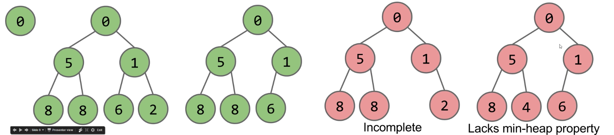
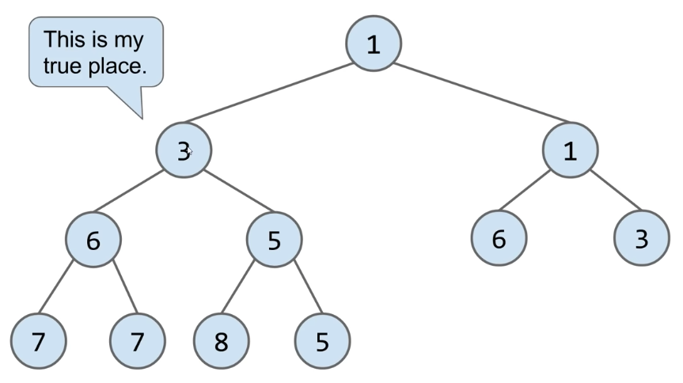
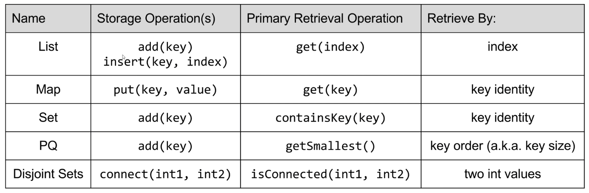

# Lecture 21: Heaps and PQs
#### 10/14/2020

## The Priority Queue Interface

### The Priority Queue Interface
```
/** (Min) Priority Queue: Allowing tracking and removal of the
  * smallest item in a priority queue */
public interface MinQP<Item> {
    // Adds the item to the priority queue
    public void add(Item x);

    // Returns the smallest item in the priority queue
    public Item getSmallest();

    // Removes the smallest item from the priority queue
    public Item removeSmallest();

    // Returns the size of the priority queue
    public int size();
}
```
- Useful if you want to keep track of the "smallest", "largest", "best" etc. seen so far

### Usage example: Unharmonious Text
- Imagine that you're part of the US Happiness Enhancement team
  - Your job: Monitor text messages of the citizens to make sure they are not having any unharmonious conversations
  - Prepare a report of M messages that seem most unharmonious
- Naive approach: Create a list of all messages sent for the entire day. Sort it using your comparator. Return the M messages that are largest

### Naive Implementation: Store and Sort
- Potentially uses a huge amount of memory Theta(N), where N is number of texts
  - Goal: Do this in Theta(M) memory using a MinPQ
  - `MinPQ<String> unharmoniousTexts = new HeapMinPQ<Transaction>(cmptr);`

### Better Implementation: Track the M Best
- Can track top M transactions using only M memory. API for MinPQ also makes code very simple (don't need to do explicit comparisons)

### How Would we Implement a MinPQ?
- Some possibilities:
  - Ordered Array
    - add: Theta(N)
    - getSmallest: Theta(1)
    - removeSmallest: Theta(N)
  - Bushy BST: Maintaining bushiness is annoying. Handling duplicate priorities is awkward
    - add: Theta(log N)
    - getSmallest: Theta(log N)
    - removeSmallest: Theta(log N)
  - HashTable: No good! Items go into random places


## Heaps

### Introducing the Heap
- BSTs would work, but need to be kept bushy and duplicates are awkward
- Binary min-heap: Binary tree that is **complete** and obeys **min-heap property**
  - Min-heap: Every node is less than or equal to both of its children
  - Complete: Missing items only at the bottom level (if any), all nodes are as far left as possible



### What Good are Heaps?
- Heaps lend themselves very naturally to implementation of a priority queue
- Questions:
  - How would you support `getSmallest()`
    - Return the root

### How Do We Add to a Heap?
- Challenge: Come up with an algorithm for `add(x)`
  - How would we insert 3?

    - Add to end of heap temporarily
    - Swim up to the hierarchy to rightful place

  - Delete min
    - Swap the last item in the heap into the root
    - Then sink your way down the hierarchy, yielding to the most "qualified" items

### Heap Operations Summary
- Given a heap, how do we implement PQ operations?
  - `getSmallest()` - return the item in the root node
  - `add(x)` - place the new employee in the last position, and promote as high as possible
  - `removeSmallest()` - assassinate the president (of the company), promote the rightmost person in the company to president. Then demote repeatedly, always taking the "better"successor


## Tree Representations

### How do we represent a tree in Java?
- Approach 1a, 1b, and 1c: Create mapping from node to children
```
public class Tree1A<Key> {
    Key k;
    Tree1A left;
    Tree1A middle;
    Tree1A right;
}
```
```
public class Tree1B<Key> {
    Key k;
    Tree1B[] children;
    ...
}
```
```
// Sibling tree
public class Tree1C<Key> {
    // Nodes at the same level point to each other's siblings
    Key k;
    Tree1C favoredChild;
    Tree1C sibling;
}
```
- Approach 2: Store keys in an array. Store parentIDs in an array
  - Similar to what we did with disjointSets
```
public class Tree2<Key> {
    Key[] keys;
    int[] parents;
    ...
}
```

- Approach 3: Store keys in an array. Don't store structure anywhere
  - To interpret array: Simply assume tree is complete
  - Obviously only works for "complete" trees
```
public class Tree3<Key> {
    Key[] keys;
}
```


### A Deep Look at Approach 3
- Write the `parent(k)` method for approach 3
```
public void swim(int k) {
    if (keys[parent(k)] > keys[k]) {
        swap(k, parent(k));
        swim(parent(k));
    }
}
```
```
public int parent(int k) {
    if (k == 0) {
        return 0;
    }
    return (k - 1) / 2;
}
```


### Approach 3B (book implementation): Leaving One Empty Spot in the Front
- Approach 3b: Store keys in an array. Offset everything by 1 spot
  - Same as 3, but leave spot 0 empty
  - Makes computation of children/parents "nicer"
    - leftChild(k) = k * 2
    - rightChild(k) = k * 2 + 1
    - parent(k) = k / 2


### Heap Implementation of a Priority Queue
- Heap
  - add: Theta(log N)
  - getSmallest: Theta(1)
  - removeSmallest: Theta(log N)
- Notes:
  - Why "priority queue"? Can think of position in tree as its "priority"
  - Heap is log N time AMORTIZED (some resizes, but no big deal)
  - BST can have constant getSmallest if you keep a pointer to smallest
  - Heaps handle duplicate priorities much more naturally than BSTs
  - Array based heaps take less memory (very roughly about 1/3) the memory of representing a tree with approach 1a)

### Some Implementation Questions
- How does a PQ know how to determine which item in a PQ is larger?
  - What could we change so that there is a default comparison?
- What constructors are needed to allow for different orderings?


## Data Structures Summary

### The Search Problem
- Given a stream of data, retrieve information of interest
  - Examples:
    - Website users post to personal page. Serve content only to friends
    - Given logs for thousands of weather stations, display weather map for specified date and time

### Search Data Structures (The particularly abstract ones)


- Abstraction often happens in layers!
  - PQ -> Heap Ordered Tree -> Tree -> {Approach 1A, 1B, 1C, 2, 3, 3B}
  - External Chaining HT -> Array of Buckets -> Bucket -> {ArrayList, Resizing Array, LinkedList, BST (requires comparable items)}
- Specialized searching data structures:


### Data Structures
- Data Structure: A particular way of organizing data
  - We've covered many of the most fundamental abstract data types, their common implementations, and the tradeoffs thereof

## Summary

### Discussion Summary: Heaps
- **Heaps** are special trees that follow a few basic rules:
  - Heaps are **complete** - the only empty parts of a heap are in the bottom row, to the right
  - In a min-heap, each node must be *smaller* than all of its child nodes. The opposite is true for max-heaps