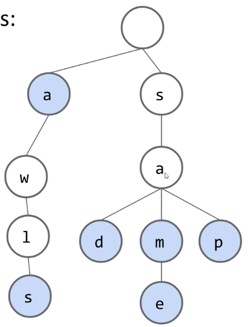
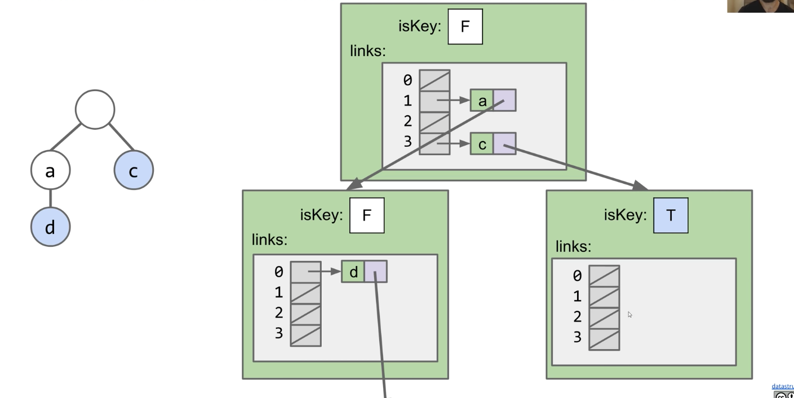
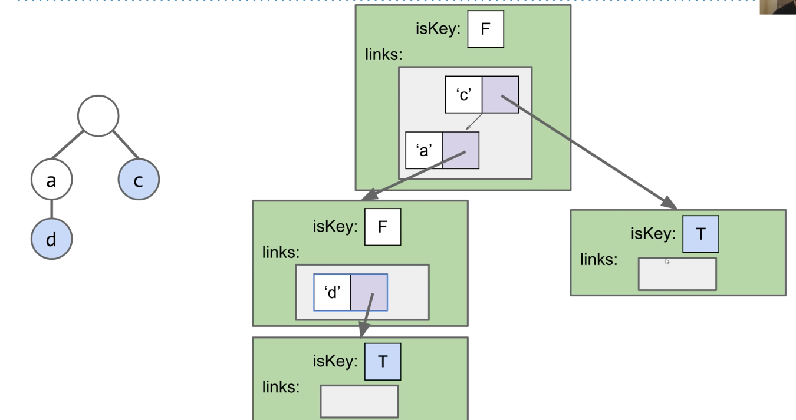

# Prefix Operations and Tries
#### 10/16/2020

## Tries

### Abstract Data Types vs. Specific Implementations
- There are many ways to implement an abstract data type
  - Today we'll talk about a new way to build a set/map

### BST and Hash Table Set Runtimes
- Runtimes for our balanced search tree and has table implementations were very fast
- If we know that our keys all have some common special property, we can sometimes get even better implementations
- Suppose we know that our keys are always single ASCII characters
  
### Special Case 1: Character Keyed Map
- Suppose we know that our keys are always ASCII characters
  - Can just use an array!
  - Simple and fast

```
public class DataIndexedCharMap<V> {
    private V[] items;
    public DataIndexedCharMap(int R) {
        items = (V[]) new Object[R];
    }
    public void put(char c, V val) {
        items[c] = val;
    }
    public V get(char c) {
        return items[c];
    }
}
```
- Constant time for both `get` and `add`

### Special Case 2: String Keyed Map
- Suppose we know that our keys are always strings
  - Can use a special data structure known as a Trie
  - Basic idea: Store each letter of the string as a node in a tree
- Tries will have great performance on:
  - get
  - add
  - special string operations

### Sets of Strings
- For String keys, we can use a "Trie". Key ideas:
  - Every node stores only one letter
  - Nodes can be shared by multiple keys


### Tries: Search Hits and Misses
- How does contains work?
  - contains("sam"): true, blue node (hit)
  - contains("sa"): false, white node (miss)
  - contains("a"): true, blue node (hit)
  - contains("saq"): false, fell off tree (miss)
- Two ways to have a search "miss":
  - If the final node is white
  - If we fall off the tree, e.g. contains("sax")

### Trie Maps
- Tries can also be maps, of course

### Tries
- Trie:
  - Short for Re**trie**val Tree
  - Inventor Edward Fredkin suggested it should be pronounced "tree", but almost everyone pronounces it like "try"


## Trie Implementation and Performance

### Very Basic Trie Implementation
- The first approach might look something like the code below
  - Each node stores a letter, a map from c to all child nodes, and a color

```
public class TrieSet {
    private static final int R = 128;  // ASCII
    private Node root;  // root of trie

    private static class Node {
        private char ch;  // Actually don't need this variable
        private boolean isKey;
        private DataIndexedCharMap next;
        private Node(char c, boolean b, int R) {
            ch = c; isKey = b;
            next = new DataIndexedCharMap<Node>(R);
        }
    }
}
```
- For each node in DataIndexedCharMap, there are 128 links

### Trie Performance in Terms of N
- Given a Trie with N keys. What is the:
  - Add runtime?
    - Theta(1)
  - Contains runtime?
    - Theta(1)
- Runtimes independent of number of keys!
- Or in terms of L, the length of the key:
  - Add: Theta(L)
  - Contains: O(L)
    - May fall off the tree
- When our keys are strings, Tries give us slightly better performance on contains and add
- One downside of the DictCharKey based Trie is the huge memory cost of storing R links per node (most of which are null)
  - Wasteful because most links are not used in real world usage


## Alternate Child Tracking Strategies

### DataIndexedCharMap Trie
- Can use ANY kind of map from character to node, e.g.
  - BST
  - Hash Table
- Fundamental problem, our arrays are "sparse", wasted memory boxes

### Alternate Idea #1: The Hash-Table Based Trie


### Alternate Idea #2: The BST-Based Trie


### The Three Trie Implementations
- When we implement a Trie, we have to pick a map to our children
  - DataIndexedCharMap: Very fast, but memory hungry
  - Hash Table: Almost as fast, uses less memory
  - Balanced BST: A little slower than Hash Table, uses similar amount of memory

### Performance of the DataIndexedCharMap, BST, and Hash Table
- Using a BST or a Hash Map to store links to children will usually use less memory
  - DataIndexedCharMap: 128 links per node
  - BST: C links per node, where C is the number of children
  - Hash Table: C links per node
  - Note: Cost per link is higher in BST and Hash Table
- Using a BST or a Hash Table will take slightly more time
  - DataIndexedCharMap is Theta(1)
  - BST is O(log R), where R is size of alphabet
  - Hash Table is O(R), where R is size of alphabet
- Since R is fixed (e.g. 128), can think of all 3 as Theta(1)

### Trie Performance in Terms of N
- When our keys are strings, Tries give us slightly better performance on contains and add
  - Using BST or Hash Table will be slightly slower, but more memory efficient
  - Would have to do computational experiments to see which is best for your application
- ...but where Tries really shine is their efficiency with special string operations!


## Trie String Operations

### String Specific Operations
- Theoretical asymptotic speed improvement is nice. But the **main appeal of tries** is their ability to efficiently support string specific operations like **prefix matching**
  - Finding all keys that match a given prefix: keysWithPrefix("sa")
  - Finding the longest prefix of a string: longestPrefixOf("sample")

### Collecting Trie Keys
- Give an algorithm for collecting all the keys in a Trie
- collect():
  - Create an empty list of results x
  - For character c in root.next.keys():
    - Call colHelp("c", x, root.next.get(c))
  - Return x
- Create colHelp
  - colHelp(String s, List<String> x, Node n)
  - If n.isKey, then x.add(s)
  - For character c in n.next.keys():
    - Call colHelp(s + c, x, n.next.get(c))

### Usages of Tries
- Give an algorithm for keysWithPrefix
- keysWithPrefix(prefix):
  - Find the node A corresponding to the string
  - Create an empty list x
  - For character c in A.next.keys():
    - Call colHelp(prefix + c, x, A.next.get(c))
- Another common operation: LongestPrefixOf


## Autocomplete

### The Autocomplete Problem
- One way to do this is to create a Trie based map from strings to values
  - Value represents how important Google thinks that string is
  - Can store billions of strings efficiently since they share nodes
  - When a user types in a string "hello", we:
    - Call `keysWithPrefix("hello")`
    - Return the 10 strings with the highest value
- The approach has one major flaw. If we enter a short string, the number of keys with the appropriate prefix will be too big

### A More Efficient Autocomplete
- One way to address this issue:
  - Each node stores its own value, as well as the value of its best substring
- Search will consider nodes in the order of "best"
  - Can stop when top 3 matches are all better than best remaining
- Details left as an exercise. Hint: Use a PQ! See Bear Maps gold points for more

### Even More Efficient Autocomplete
- Can also merge nodes that are redundant where there's no branching!
  - This version of trie is known as a "radix tree" or "radix trie"
  - Won't discuss


## Trie Summary

### Tries
- When your key is a string, you can use a Trie:
  - Theoretically better performance than hash table or search tree
  - Have to decide on a mapping from letter to node. Three natural choices:
    - DataIndexedCharMap, i.e. an array of all possible child links
    - Bushy BST
    - Hash Table
  - All three choices are fine, though hash table is probably the most natural
  - Supports special string operations like longestPrefixOf and keysWithPRefix
    - keysWithPrefix is the heart of important technology like autocomplete
    - Optimal implementation of Autocomplete involves use of a priority queue!

### Domain Specific Sets and Maps
- More generally, we can sometimes take special advantage of our key type to improve our sets and maps
  - Example: Tries handle String keys. Allow for fast string specific operations
  - Note: There are many other types of string sets/maps out there

### Discussion Summary: Tries
- Tries are special trees mostly used for language tasks
- Each node in a trie is marked as being a word-end or not, so you can quickly check whether a word exists within your structure
