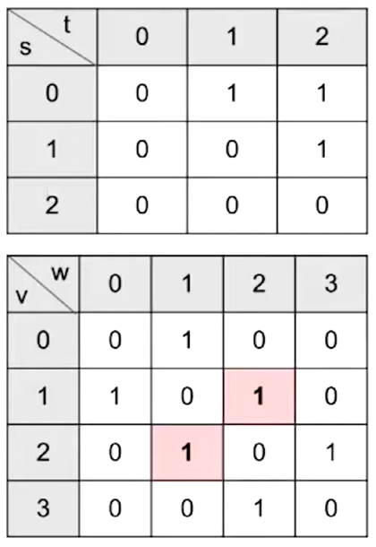
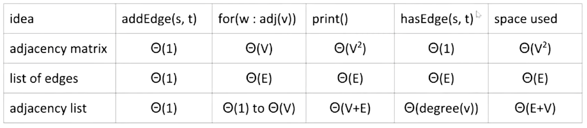
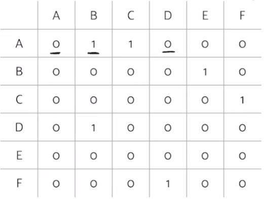

# Lecture 24: Graph Traversals and Implementations
#### 10/21/2020

### Note
- Not in scope for 2020 midterm

### Graph Traversals
- DFS Preorder
- DFS Postorder
- BFS order: Act in order of distance from a vertex
- Graph traversals are, in general, not unique

### Shortest Path Problem
- Goal: Find the shortest path between s and every other vertex
- **Breadth First Search**
  - Initialize a queue with a starting vertex s and mark that vertex
    - A queue is a list that has two operations: enqueue (aka addLast) and dequeue (aka removeFirst)
    - Let's call this queue our **fringe**
  - Repeat until queue is empty:
    - Remove vertex v from the front of the queue
    - For each unmarked neighbor n of v:
      - Mark n
      - Set edgeTo[n] = v (and distTo[n] = distTo[v] + 1)

### BreadthFirstSearch for Google Maps
- Would breadth first search be a good algorithm for a navigation tool (e.g. Google Maps)?
  - Assume vertices are intersection and edges are roads connecting intersections
- Some roads are longer than others
  - BAD!


## Graph API

### Graph Representations
- To implement our graph algorithms like BreadthFirstPaths and DepthFirstPaths, we need:
  - **An API** (Application Programming Interface) for graphs
    - Graph methods, including their signatures nad behaviors
    - Defines how Graph client programmers must think
  - An underlying data structure to represent our graph
- Our choices have profound implications on:
  - Runtime
  - Memory usage
  - Difficulty of implementing algorithms

### Graph API Decision #1: Integer Vertices
- Common convention: Number nodes irrespective of "label", and use number throughout the graph implementation. To lookup a vertex by label, you'd need to use a Map<Label, Integer>

### Graph API
- The Graph API from the textbook:

```
public class Graph {
    public Graph(int V);  // Create empty graph with v vertices
    public void addEdge(int v, int w);  // add an edge v-w
    Iterable<Integer> adj(int v);  // vertices adjacent to v
    int V();  // number of vertices
    int E();  // number of edges
}
```
- Some features:
  - Number of vertices must be specified in advance
  - Does not support weights (labels) on nodes or edges
  - Has no method for getting the number of edges for a vertex (i.e. its degree)
- Example client:
```
/** degree of vertex v in graph G */
public static int degree(Graph G, int v) {
    int degree = 0;
    for (int w : G.adj(v)) {
        degree += 1;
    }
    return degree;
}
```
```
/** Prints out all the edges in a graph */
public static void print(Graph G) {
    for (int v = 0; v < G.V(); v += 1) {
        for (int w : G.adj(v)) {
            System.out.println(v + "-" + w);
        }
    }
}
```

### Graph API and DepthFirstPaths
- Our choice of Graph API has deep implications on the implementations of DepthFirstPaths, BreadthFirstPath, print, and other graph "clients"


## Graph Representation and Graph Algorithm Runtimes

### Graph Representations
- To implement our graph algorithms like BreadthFirstPaths and DepthFirst Paths, we needed an underlying data structure to represent our graphs
  - Our choices have implications on:
    - Runtime
    - Memory usage
- There are many possible implementations we could choose for our graphs
- Graph Representation 1: Adjacency Matrix
  - Represent each edge as a 2-D matrix
     
  - For undirected graph:
    - Each edge is represented twice in the matrix
  - G.adj(2) would return an iterator where we can call next() and get its adjacent vertices
  - Total runtime to iterate over all neighbors of v is Theta(V)
    - Underlying code has to iterate through the entire array to handle next() and hasNext() calls (iterates through an entire row/column of our 2-D matrix)

### Graph Printing Runtime
- What is the runtime of the print client we wrote if the graph uses an **adjacency-matrix** representation, where V is the umber of vertices, and E is the total number of edges
  - Theta(V^2)
    - Runtime to iterate over v's neighbors is Theta(V)
    - and we consider V vertices

### More Graph Representations
- Representation 2: Edge Sets: Collection of all edges
  - Example: HashSet<Edge>, where each Edge is a pair of ints
  - `{(0, 1), (0, 2), (1, 2)}`
- Representation 3: Adjacency lists (most popular approach)
  - Common approach: Maintain array of lists indexed by vertex number
  - Most popular approach for representing graphs

### Graph Printing Runtime
- What is the runtime of the print client we wrote if the graph uses an **adjacency-list** representation, where V is the umber of vertices, and E is the total number of edges
  - Theta(V + E)
    - Create V iterators and print E times
    - Runtime to iterate over v's neighbors?
      - Omega(1), O(V)
    - How many vertices do we consider?
      - V
  - Best case: Theta(V)
  - Worst case: Theta(V^2)
- How to interpret: No matter what "shape" of increasingly complex graphs we generate, as V and E grow, the runtime will always grow exactly as Theta(V + E)
  - Example shape 1: Very sparse graph where E grows ver slowly, e.g. every vertex is connected to its square:
    - E is Theta(sqrt(V)). Runtime is Theta(V + sqrt(V)), which is just Theta(V)
  - Example shape 2: Very dense graph where E grows very quickly, e.g. a complete graph
    - E is Theta(V^2). Runtime is Theta(V + V^2), which is just Theta(V^2)
- Runtime of some basic operations for each representation:

- In practice, adjacency lists are most common
  - Many graph algorithms rely heavily on adj(s)
  - Most graphs are sparse (not many edges in each bucket)

### Barebones Undirected Graph Implementation
```
public class Graph {
    private final int V; 
    private List<Integer>[] adj;

    public Graph(int V) {
        this.V = V;
        adj = (List<Integer>[]) new ArrayList[V];
        for (int v = 0; v < V; v++) {
            adj[v] = new ArrayList<Integer>();
        }
    }

    public void addEdge(int v, int w) {
        adj[v].add(w); 
        adj[w].add(v);
    }

    public Iterable<Integer> adj(int v) {
        return adj[v];
    }
}
```


## Graph Traversal Implementations and Runtime

### Depth Fist Search Implementation
- Common design pattern in graph algorithms: Decouple type from processing algorithm
  - Create a graph object
  - Pass the graph to a graph-processing method (or constructor) in a client class
  - Query the client class for information

```
public class Paths {
    public Paths(Graph G, int s);  // Find all paths from G
    boolean hasPathTo(int v);  // is there a path from s to v?
    Iterable<Integer> pathTo(int v);  // path from s to v (if any)
}
```

### DepthFirstPaths Demo
- Goal: Find a path from so to every other reachable vertex, visiting each vertex at most once. dfs(v) is as follows:
  - Mark v
  - For each unmarked adjacent vertex w:
    - set edgeTo[w] = v
    - dfs(w)

### DepthFirstPaths, Recursive Implementation
```
public class DepthFirstPaths {
    private boolean[] marked;
    private int[] edgeTo;
    private int s;

    public DepthFirstPaths(Graph G, int s) {
        ...
        dfs(G, s);
    }

    public void dfs(Graph G, int v) {
        marked[v] = true;
        for (int w : G.adj(v)) {
            if (!marked[w]) {
                edgeTo[w] = v;
                dfs(G, w);
            }
        }
    }

    public boolean hasPathTo(int v) {
        return marked[v];
    }

    public Iterable<Integer> pathTo(int v) {
        if (!hasPathTo(v)) return null;
        List<Integer> path = new ArrayList<>();
        for (int x = v; x !=s; x = edgeTo[x]) {
            path.add(x);
        }
        path.add(s);
        Collections.reverse(path);
        return path;
    }
}
```

### Runtime for DepthFirst Paths
- Give a big O bound for the runtime for the DepthFirstPaths constructor (assume graph uses adjacency list)
  - O(V + E)
    - Each vertex is visited at most once (O(V))
      - Vertex visits (no more than V calls)
    - Each edge is considered at most twice (O(E))
      - edge considerations (no more than 2E calls)
    - Cost model in analysis above is the sum of:
      - Number of dfs calls
      - marked[w] checks

### Runtime for DepthFirstPaths
- Very hard question: Could we say the runtime is O(E)?
  - Argument: Can only visit a vertex if there is an edge to it
    - Number of DFS calls is bounded above by E
    - So why not just say O(E)?
  - Can't say O(E)!
    - Constructor has to create an all false `marked` array
    - This marking of all vertices as false takes Theta(V) time
  - Our cost model earlier (dfs calls + marked checks) does not provide a tight bound

### BreadthFirstPaths Implementation
```
public class BreadthFirstPaths {
    private boolean[] marked;
    private int[] edgeTo;
    ...

    private void bfs(Graph G, int s) {
        Queue<Integer> fringe = new Queue<Integer>();
        fringe.enqueue(s);
        marked[s] = true;
        while (!fringe.isEmpty()) {
            int v = fringe.dequeue();
            for (int w : G.adj(v)) {
                if (!marked[w]) {
                    fringe.enqueue(w);
                    marked[w] = true;
                    edgeTo[w] = v;
                }
            }
        }
    }
}
```
- Runtime for shortest paths is also O(V + E)
  - Based on cost model: O(V) .next() calls and O(E) marked[w] checks
  - Note, can't say Theta(V+E), example: Graph with no edges touching source
- Space is Theta(V)
  - Need arrays of length V to store information


## Layers of Abstraction

### Clients and Our Graph API
- Our choice of Graph API has deep implications on the implementation of DepthFirstPaths, BreadthFirstPaths, etc.
- Our choice of how to implement the Graph API has profound implications on runtime

### Runtime for DepthFirstPaths
- Give a tight O bound for the runtime for the DepthFirstPaths constructor
  - O(V^2)


## Summary

### Summary
- BFS: Uses a queue instead of recursion to track what work needs to be done
- Graph API: We used the Princeton Algorithms book API today
- Graph Implementations: Saw three ways to implement our graph API
  - Adjacency matrix
  - List of edges
  - Adjacency list (most common in practice)
- Choice of implementation has big impact on runtime and memory usage!
  - DFS and BFS runtime with adjacency list: O(V + E)
  - DFS and BFS runtime with adjacency matrix: O(V^2)


## Discussion Review

### Graphs
- **Graphs** are structures that contain *nodes* and *edges*
- Graphs can be directed or undirected

### Graph Representations
- **Adjacency lists** list out all the nodes connected to each node in our graph
  - In the example below, edges are directed
  ```
  A: B, C
  B: E
  C: F
  D: B
  E:
  F: D
  ```
  - Slightly inefficient if graph is more complete
- **Adjacency matrices** are true if there is a line going from node A to B and false otherwise (can be used for directed graphs)
  - Indexing into a matrix is very fast
  - However, we have to traverse though all possible children every single time
  

### Graph Searches
- **Breadth First Search** goes in order of how far each node is form the starting node. Programatically this is done using a queue
- **Depth First Search** goes all the way down one path before exploring others. Programatically this is done using a stack

### Dijkstra's Algorithm
- **Dijkstra's algorithm** is a method of finding the shortest path from one node to every other node in the graph. You use a priority queue that sorts points based off of their distance to the root node
- Steps:
  - Pop node from the top of the queue - this is the current node
  - Add/update distance of all of the children of the current node
  - Re-sort the priority queue
  - Finalize the distance to the current node from the root
  - Repeat

### A*
- **A\*** is a method of finding the shortest path from one node to a specific other node in the graph. It operates similarly to Dijkstra's except for the fact that we use a (given) heuristic to which path is the best to our goal point
- Steps:
  - Pop node from the top of the queue - this is the current node
  - Add/update distances of all of the children fo the current node. This distance will be the sum of the distance up to that child node and our guess of how far away the goal node is (our heuristic)
  - Re-sort the priority queue
  - Check if we've hit the goal node (if so we stop)
  - Repeat
- The only constraints on our heuristic is that it must be less than or equal to the true distance to the goal node