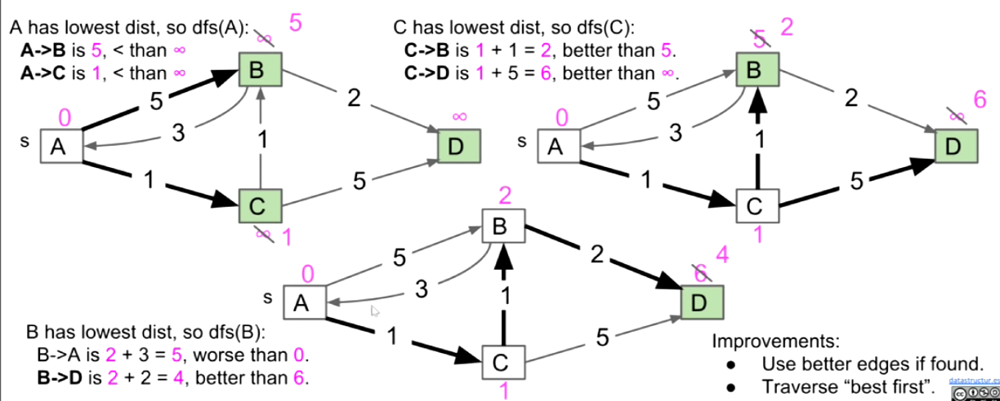
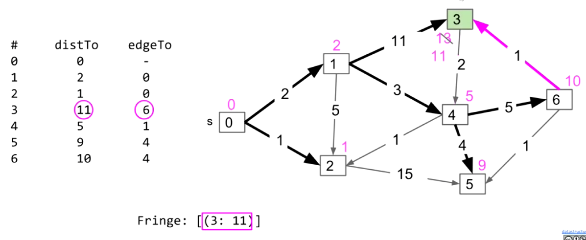

# Lecture 25: Shortest Paths
#### 10/23/2020

### Graph Problems
- Which is better?
  - DFS or BFS

### BFS vs. DFS for Path Finding
- Possible considerations:
  - **Correctness**. Do both work for all graphs?
    - Yes
  - **Output Quality**. Does one give better results?
    - BFS is a 2-for-1 deal, not only do you get paths, but your paths are also guaranteed to be shortest
  - **Time Efficiency**. Is one more efficient than the other?
    - Should be very similar. Both consider all edges twice
  - **Space Efficiency**. Is one more efficient than the other?
    - DFS is worse for spindly graphs
      - Call stack gets very deep
      - Computer needs Theta(V) memory to remember recursive calls
    - BFS is worse for absurdly "bushy" graphs
      - Queue gets very large. In worst case, queue will require Theta(V) memory
    - Note: In our implementations, we have to spend Theta(V) memory anyway to track distTo and edgeTo arrays

### Breadth FirstSearch for Google Maps
- BFS would not be a good choice for a google maps style navigation application
  - We need an algorithm that takes into account edge distances, also known as "edge weights"

## Dijkstra's Algorithm

### Single Source Single Target Shortest Paths
- Observation: Solution will always be a path with no cycles (assuming non-negative weights)

### Problem: Single Source Shortest Paths
- Goal: Find the shortest paths from **source** vertex s to every other vertex
- Observation: Solution will always be a **tree**
  - Can think of as the union of the shortest paths to all vertices

### Edge Count
- If G is a connected edge-weighted graph with V vertices and E edges, how many edges are in the **Shortest Paths Tree** (SPT) of G? [assume every vertex is reachable]
  - Since the solution is a tree, there are V-1 edges

### Creating an Algorithm
- Start with a bad algorithm
  - Algorithm begins with all vertices unmarked and all distance infinite. No edges in the shortest paths tree (SPT)
- Bad algorithm #1: Perform a depth first search. When you visit v:
  - For each edge from v to w, if w is not already part of SPT, add the edge
    - Note: This WILL NOT WORK
- Bad algorithm #2: Perform a depth first search. When you visit v:
  - For each edge from v to w, add edge to the SPT **only if that edge yields better distance** (we'll call this process "edge **relaxation**")
  - Improvements:
    - Use better edges if found

### Dijkstra's Algorithm
- Perform a **best first search** (closest first). When you visit v:
  - For each v to w, **relax that edge**
  - Improvements:
    - Use better edges if found
    - Traverse "best first"
  - Insert all vertices into fringe PQ (e.g. use a heap), storing vertices in order of distance from source
  - Repeat: Remove (closest) vertex v from PQ, and relax all edges pointing from v
  - Note: If non-negative weights, **impossible for any inactive vertex (i.e. already visited and not on the fringe) to be improved**
    - Would result in a cycle if it does

## Dijkstra's Correctness and Runtime

### Dijkstra's Algorithm Pseudocode
- Dijkstra's:
  - PQ.add(source, 0)
  - For other vertices v, PQ.add(v, infinity)
  - While PQ is not empty:
    - p = PQ.removeSmallest()
    - Relax all edges from p
- **Relaxing** and edge p -> q with weight w:
  - If distTo[p] + w < distTo[q]:
    - distTo[q] = distTo[p] + w
    - edgeTo[q] = p
    - PQ.changePriority(q, distTo[q])
- Key invariants:
  - edgeTo[v] is the best known predecessor of v
  - distTo[v] is the best known total distance from source to v
  - PQ contains all unvisited vertices in order of distTo
- Important properties:
  - Always visits vertices in order of total distance from source
  - Relaxation always fails on edges to visited (white) vertices

### Guaranteed Optimality
- Dijkstra's Algorithm
  - Visit vertices in **order of best-known distance** from source. On visit, **relax** every edge from the visited source
- Guaranteed to return a correct result if all edges are non-negative
  - Proof relies on the property that relaxation always fails on edges to visited vertices
- Proof sketch: Assume all edges have non-negative weights
  - At start, distTo[source] = 0, which is optimal
  - After relaxing all edges from source, let vertex v1 be the vertex with minimum weight, i.e. that is closest to the source. Claim: distTo[v1] is optimal, and thus future relaxations will fail. Why?
    - distTo[p] >= distTo[v1] for all p, therefore
    - distTo[p] + w >= distTo[v1]
  - Can use induction to prove that this holds for all vertices after dequeuing

### Negative Edges
- Dijkstra's Algorithm
  - Visit vertices in **order of best-known distance** from source. On visit, **relax** every edge from the visited vertex
- Dijkstra's can fail if graph has negative weight edges
  - Relaxation of already visited edges can succeed

### Dijkstra's Algorithm Runtime
- Priority Queue operation count, assuming binary heap based PQ:
  - add: V, each costing O(log V) time
  - removeSmallest: V, each costing O(log V) time
  - changePriority: E, each costing O(log V) time
- Overall runtime: O(V\*log(V) + V\*log(V) + E\*log(V))
  - Assuming E > V, this is just O(E log V) for a connected graph

## A*

### Single Target Dijkstra's
- Is this a good algorithm for a navigation application
  - Will it find the shortest path?
    - Yes!
  - Will it be efficient
    - No. It will look for shortest path to other places

### The Problem with Dijkstra's
- We have only a **single target** in mind, so we need a different algorithm. How can we do better?

### How can we do better?
- Explore one direction first?

### Introducing A*
- Simple idea:
  - Visit vertices in order of d(Denver, v) + h(v, goal), where h(v, goal) is an estimate of the distance from v to our goal NYC
  - In other words, look at some location if:
    - We already know the fastest way to reach v
    - AND we suspect that v is also the fastest way to NYC taking into account the time to get to v
- Observations:
  - Not every vertex gets visited
  - Result is not a shortest paths tree for a vertex, but that's OK since we only care about a path to a single vertex

### A* Heuristic Example
- How do we get our estimate?
  - Estimate is an arbitrary **heuristic** h(v, goal)
  - heuristic: "using experience to learn and improve"
  - Doesn't have to be perfect

## A* Heuristics (Not covered in this class)

### Heuristics and Correctness
- Four our version of A* to give the correct answer, out A heuristic must be:
  - **Admissible**: h(v, NYV) <= true distance from v to NYC
  - **Consistent**: For each neighbor of w:
    - h(v, NYV) <= dist(v, w) + h(w, NYC)
    - Where dist(v, w) is the weight of the edge from v to w

### Consistency and Admissibility (Beyond scope)
- All consistent heuristics are admissible
  - "Admissible" means that the heuristic never overestimates

## Summary

### Summary: Shortest Paths Problems
- Single source, multiple targets:
  - Can represent shortest path from start to every vertex as a shortest paths tree with V-1 edges
  - Can find the SPT using Dijkstra's algorithm
- Single source, single target:
  - Dijkstra's is inefficient (searches useless parts of the graph)
  - Can represent shortest path as path (with up to V-1 vertices, but probably far fewer)
  - A* is potentially much faster than Dijkstra's
    - Consistent heuristic guarantees correct solution
