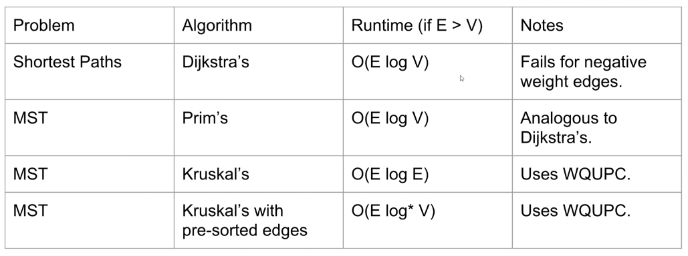
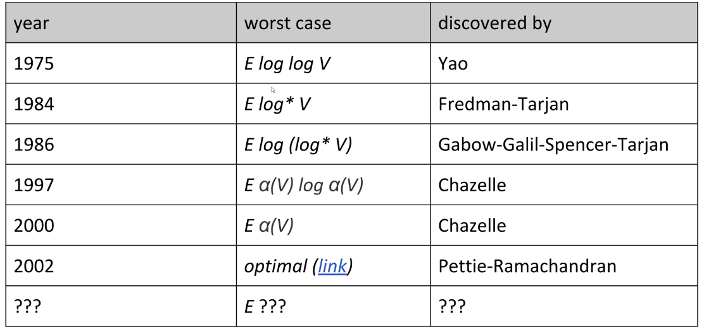

# Lecture 26: Minimum Spanning Trees
#### 10/29/2020

## Spanning Trees

### Spanning Trees
- Given an **undirected** graph, **spanning tree** T is a subgraph of G, where T:
  - Is connected
  - Is acyclic
  - Includes all of the vertices
- A **minimum spanning tree** is a spanning tree of minium total weight
  - Ex: Directly connecting buildings by power lines

### MST Applications
- Handwriting recognition
- Medical imaging (e.g. arrangement of nuclei in cancer cells)

### MST vs. SPT
- A shortest paths tree depends on the start vertex:
  - Because it tells you how to get from a source to EVERYTHING
- There is no source for a minimum spanning tree
- Nonetheless, the MST sometimes happens to be a SPT for a specific vertex
  - However, this is not always true; sometimes, there is no SPT that is the MST

### A Useful Tool for Finding the MST: Cut Property
- A **cut** is an assignment of a graph's nodes to two non-empty sets
- A **crossing edge** is an edge which connects a node from one set to a node from the other set
- **Cut property**: Given any cut, minimum weight crossing edge is in the MST
  - For rest of today, we'll assume edge weights are unique

### Cut Property Proof
- Suppose that the minimum crossing edge *e* were not in the MST
  - Adding *e* to the MST creates a cycle
  - Some other edge *f* must also be a crossing edge
  - Removing *f* and adding *e* is a lower weight spanning tree
  - Contradiction! *e* must be in the MST

### Generic MST Finding Algorithm
- Start with no edges in the MST
  - Find a cut that has no crossing edges in the MST
  - Add smallest crossing edge to the MST
  - Repeat until V-1 edges
- This should work, but we need some way of finding a cut with no crossing edges!
  - Random isn't a very good idea


## Prim's Algorithm

### Prim's Algorithm
- Start from some arbitrary start node
  - Repeatedly add shortest edge that has one node inside the MST under construction
  - Repeat until V-1 edges
- Why does Prim's work? Special case of generic algorithm
  - Suppose we add edge e = v->w
  - Side 1 of cut is all vertices connected to start, side 2 is all the others
  - No crossing edge is black (all connected edges on side 1)
  - No crossing edge as lower weight (consider in increasing order)

### Prim's Algorithm Implementation
- The natural implementation of the conceptual version of Prim's algorithm is highly inefficient
- Can use some cleverness and a PQ to speed things up

### Prim's Demo
- Insert all vertices into fringe PQ, storing vertices in order of distance from tree
- Repeat: Remove (closest) vertex v from PQ, and relax all edges pointing from v
- Note: Vertex removal in this implementation of Prim's is equivalent to edge addition in the conceptual version of Prim's
- No need to reconsider edges that lead to "marked" vertices

### Prim's vs. Dijkstra's
- Prim's and Dijkstra's algorithms are exactly the same, except Dijkstra's considers "distance from the source", and Prim's considers "distance from the tree."
- Visit order:
  - Dijkstra's algorithm visits vertices in order of distance from the source
  - Prim's algorithm visits vertices in some order of distance from the MST under construction
- Relaxation:
  - Relaxation in Dijkstra's considers and edge better based on distance to source
  - Relaxation in Prim's considers an edge better based on distance to tree

### Prim's Implementation (Psuedocode)
```
public class PrimMST {
    public PrimMST(EdgeWeightedGraph G) {
        edgeTo = new Edge[G.V()];
        distTo = new double[G.V()];
        marked = new boolean[G.V()];
        fringe = new SpecialPQ<Double>(G.V());

        distTo[s] = 0.0;
        setDistancesToInfinityExceptS(s);

        /* Fringe is ordered by distTo tree. 
        Must be a specialPQ like Dijkstra's */
        insertAllVertices(fringe);

        /* Get vertices in order of distance from tree */
        while (!fringe.isEmpty()) {
            // Get vertex closest to tree that is unvisited
            int v = fringe.delMin();
            // Scan means to consider all of a vertex's outgoing edges
            scan(G, v)
        }
    }

    private void scan(EdgeWeightedGraph G, int v) {
        marked[v] = true;  // Vertex is closest, so add to MST
        for (Edge e : G.adj(v)) {
            int w = e.other(v);

            /* Already in MST, so go to next edge */
            if (marked[w]) {continue;}  
            
            /* Better path to a particular vertex found, 
            so update current best known for that vertex */
            if (e.weight() < distTo[w]) {
                distTo[w] = e.weight();
                edgeTo[w] = e;
                pq.decreasePriority(w, distTo[w]);
            }
        }
    }
}
```

### Prim's Runtime
- What is the runtime of Prim's algorithm?
  - Assume all PQ operations take O(log V) time
  - Give your answer in Big O notation
- Priority Queue operation count, assume binary heap based PQ:
  - Insertion: V, each costing O(log V) time
  - Delete-min: V, each costing O(lov V) time
  - Decrease priority: O(E), each costing O(log V) time
- Overall runtime: O(V*log(V) + V*log(V) + E*log(V))


## Kruskal's Algorithm

### Kruskal's Demo
- Consider edges in order of increasing weight. Add to MST unless a cycle is created
  - Repeat until V-1 edges have been added to the MST
  - (Really just the cut property in disguise)
- Will require a fringe will all edges ordered in smallest weight
- Add edges to our MST set and connect the necessary vertices in a WeightedQuickUnion object

### Kruskal's Algorithm
- Initially mark all edges gray
  - Consider edges in increasing order of weight
  - Add edge to MST (mark black) unless doing so creates a cycle
  - Repeat until V-1 edges
- Why does Kruskal's work? Special case of generic MST algorithm
  - Suppose we add edge e = v->w
  - Side 1 of cut is all vertices connected to v, side 2 is everything else
  - No crossing edge is black (since we don't allow cycles)
  - No crossing edge has lower weight (consider in increasing order)

### Kruskal's Implementation (Psueocode)
```
public class KruskalMST {
    private List<edge> mst = new ArrayList<Edge>();

    public KruskalMST(EdgeWeightedGraph G) {
        MinPQ<Edge> pq = new MinPQ<Edge>();
        for (Edge e : G.edges()) {
            pq.insert(e);
        }

        WeightedQuickUnionPC uf = 
            new WeightedQuickUnionPC(G.V());

        while(!pq.isEmpty() && mst.size() < G.V() - 1) {
            Edge e = pq.delMin();
            int v = e.from();
            int w = e.to();
            if (!uf.connected(v, w)) {
                uf.union(v, w);
                mst.add(e);
            }
        }
    }
}
```
- What is the runtime of Kruskal's algorithm?
  - Assume all PQ operations take O(log(V)) time
  - Assume all WQU operations take O(log* V) time
  - Give answer in bit O notation

### Kruskal's Runtime
- Kruskal's algorithm is O(E log E)
  - Insertion: E, each costing O(log E) time: O(E log E)
  - Delete minimum: O(E) times, each costing O(log E) time: O(E log E)
  - Union: O(V) times, each costing O(log* V) time: O(V log* V)
  - isConnected: O(E) times, each costing O(log* V) time: O(E log* V)
  - Total runtime is O(E log E + V log* V + E log* V)
- Note: If we use a pre-sorted list of edges (instead of a PQ), then we can simply iterate through the list in O(E) time, so overall runtime is O(E log* V)

### Shortest Paths and MSt algorithms Summary

- Can we do better than O(E log* V)?

### 170 Spoiler: State of the Art Compare-Based MST Algorithms



## CSM Summary: Graph Algorithms

### Depth First Search (DFS)
- fringe: Stack
- Main idea: Traverse as far as possible from start node, visiting unvisited vertices

### Breadth First Search (BFS)
- fringe: Queue
- Main idea: Traverse vertices based on number of edges from start vertex

### Shortest Paths Tree vs Minimum Spanning Tree
- Shortest Paths Tree (SPT) from A
  - Minimizes distance between A and all other vertices
    - Must define a start vertex
- Minimum Spanning Tree (MST)
  - Minimizes total edge weight (cost) of tree

### Shortest Paths Tree Algorithms
- Dijkstra's
  - Priority of each node in PQ is distance to start vertex
  - Runtime: O((E +V)logV) ~ O(E log V)
- A*
  - Same as Dijkstra's but a heuristic value is added to each node
  - heuristic: prediction of cost from node to goal
    - admissible: heuristic is an underestimate of true cost
    - consistent: difference between heuristics of two nodes is at most the true cost between them
      - h(A) - h(B) <= cost(A, B)
  - Runtime: Same as Dijkstra's

### Dijkstra's/A*/Prim's Runtime
- Runtime: O((E + V)logV) ~ O(E log V)
  - Usually more edges in a graph than vertices
- Runtime analysis:
  - Add to PQ: O(log V) V times -> O(V log V)
  - Remove from PQ: O(log V) V times -> O(V log V)
  - Change priority: O(log V) at most E times -> O(E log V)
    - E times, since this is the highest possible degree of a vertex
      - There are E ways to visit this vertex, worst case we update the priority each time

### Cut Property
- A **cut** of a graph is a set of edges that separates the vertices of the graph in two
- **Cut Property:** The lightest edge across a cut is in *some* MST
- Reasoning:
  - MST must span all vertices, so the two parts of the graph *must* be connected somehow
  - Minimize total cost of tree by choosing lightest edge as connection

### MST Algorithms
- Prim's
  - Similar to Dijkstra's, but Prim's considers distance from tree instead of distance from start vertex
  - Fringe: priority queue
    - Priority of each node in queue is the edge weight between that node and the forming tree
  - Runtime: O(E log V) same analysis as Dijkstra's
  - The cut in Prim's is the edges between the vertices in the tree so far and those not in the tree. The algorithm then picks the lightest edge across that cut
- Kruskal's
  - Sort edges from least to greatest
  - Add edges in order as long as the edge doesn't create a cycle
  - Runtime: O(E log E) <- Dominated by time for sorting edges
  - How do we check if adding an edge forms a cycle?
    - Use a disjoint sets data structure
    - When connecting vertices u and v:
      - Ask if u and v are connected
      - If they are not, then we add the edge and union(u, v)
      - Else, don't add edge (u, v) to the MST
