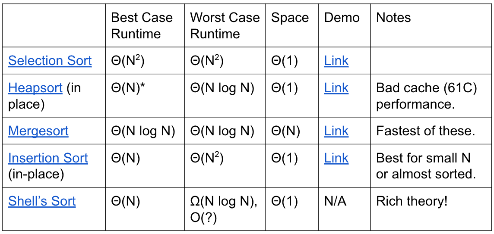

# Lecture 29: Basic Sorts
#### 11/4/2020

### Sorting Definitions
- An **ordering relation** < for keys a, b, and c has the following properties:
  - Law of Trichotomy: Exactly one of a < b, a = b, b < a is true
  - Law of Transitivity: If a < b, and a < c, then a < c
- An ordering relation with the properties above is known as a "total order"
- A **sort** is a permutation (re-arrangement) of a sequence of elements that puts the keys into non-decreasing order relative to a given ordering relation

### Java Note
- Ordering relations are typically given in the form of compareTo or compare methods

```
import java.util.Comparator;

public class LengthComparator implements Comparator<String> {
    public int compare(String x, String b) {
        return x.length() - b.length();
    }
}
```

### Sorting: An Alternate Viewpoint
- An **inversion** is a pair of elements that are out of order with respect to <.
  - e,g, 0 1 1 2 3 4 8 6 9 5 7 has 6 inversions out of 55 max
- Another way to state the goal of sorting:
  - Given a sequence of elements with Z inversions
  - Perform a sequence of operations that reduces inversions to 0

### Performance Definitions
- Characterizations of the runtime efficiency are sometimes called the **time complexity** of an algorithm. Example:
  - Dijkstra's has time complexity O(E log V)
- Characterizations of the "extra" memory usage of an algorithm is sometimes called the **space complexity** of an algorithm
  - Dijkstra's has space complexity Theta(V) (for queue, distTo, edgeTo)
    - Note that the graph takes up space Theta(V + E), but we don't count this as part of the space complexity of Dijkstra since the graph itself already exists and is an input to Dijkstra's


## Selection Sort and Heapsort

### Selection Sort
- We've seen this already
  - Find smallest item
  - Swap this item to the front and "fix" it
  - Repeat for unfixed items until all items are fixed
- Selection sorting N item:
  - Find the smallest item in the unsorted portion of the array
  - Move it to the end of the sorted portion of the array
  - Selection sort the remaining unsorted items
- Sort properties:
  - Theta(N^2) time if we use an array (or similar data structure)
- Seems inefficient: We look through entire remaining array every time to find the minimum

### Naive Heapsort: Leveraging a Max-Oriented Heap
- Idea: Instead of rescanning entire array looking for minimum, maintain a heap so that getting the minimum is fast!
- We'll use a max-oriented heap
- Naive heapsorting N items:
  - Insert all items into a max heap, and discard input array. Create output array
  - Repeat N times:
    - Delete largest item from the max heap
    - Put the largest item at the end of the unused part of the output array
- Heapsort runtime and memory:
  - Runtime is O(N log N)
    - Getting items into the heap O(N log N) time
    - Selecting largest item: Theta(1)
    - Removing largest item: O(log N)
  - Memory usage is Theta(N) to build the additional copy of all of our data
    - Worse than selection sort
    - Can eliminate this extra memory cost with some fancy trickery

### In-place Heapsort
- Alternate approach, treat input array as a heap
  - Rather than inserting into a new array of length N + 1, use a process known as "bottom-up heapification" to convert the array into a heap
    - To bottom-up heapify, just sink nodes in reverse level order
  - Avoids need for extra copy of all data
  - Once heapified, algorithm is almost the same as naive heap sort
- Heap sorting N items:
  - Bottom-up heapify input array:
    - Sink nodes in reverse level order: sink(k)
    - After sinking, guaranteed that tree rooted at position k is a heap
    - Repeat N times:
      - Delete largest item from the max heap, swapping root with last item in the heap
  - Since tree rooted at position 0 is the root of a heap, then entire array is a heap
- In-place Heapsort runtime and memory:
  - Runtime is O(N log N), same as regular heapsort
    - Best case runtime of Theta(N)
      - An array of all duplicates will yield linear runtime
  - Extra: the bottom-up heapification is Theta(N) in the worst case

  - Memory complexity is Theta(1)
    - Reuse the same array
    - The only extra memory we need is a constant number of instance variables (e.g. size)
    - Unimportant: If we employ recursion to implement various heap operations, space complexity is Theta(log N) due to need to track recursive calls. The difference between Theta(log N) and Theta(1) space is effectively nothing
  - Has bad cache performance


## Mergesort

### Mergesort
- Mergesort
  - Split items into 2 roughly even pieces
  - Mergesort each half (recursively)
  - Merge the two sorted halves to form the final result
- Time complexity: Theta(N log N) runtime
  - Space complexity with auxiliary array: Costs theta(N) memory
- Also possible to do in-place merge sort, but algorithm is very complicated, and runtime performance suffers by a significant constant factor


## Insertion Sort

### Insertion Sort
- General strategy:
  - Starting with an empty output sequence
  - Add each item from input, inserting into output at right point
- Naive approach, build entirely new output
  - For naive approach, if output sequence contains k items, worst cost to insert a single item is k
    - Might need to move everything over
- More efficient method:
  - Do everything in place using swapping

### In-place Insertion Sort
- General strategy:
  - Repeat for i = 0 to N - 1:
    - Designate item i as the traveling item
    - Swap item backwards until traveller is in the right place among all previously examined items
- Runtime analysis:
  - Omega(N), O(N^2)
    - Runtime is at least linear since every item is considered as the "traveler" at least once

### Observation: Insertion Sort on Almost Sorted Arrays
- For arrays that are almost sorted, insertion sort does very little work
- Runtime is equal (proportional) to the number of inversions

### Insertion Sort Sweet Spots
- On arrays with a small number of inversions, insertion sort is extremely fast
  - One exchange per inversion (and number of comparisons is similar)
    - Runtime is Theta(N + K) where K is number of inversions
  - Define an **almost sorted** array as one in which number of inversions <= cN for some c. Insertion sort is excellent on these arrays
- Less obvious: For small arrays (N < 15 or so), insertion sort is fastest
  - More of an empirical fact than a theoretical one
  - Theoretical analysis beyond scope of the course
  - Rough idea: Divide and conquer algorithms like heapsort/mergesort spend too much time dividing, but insertion sort goes straight to the conquest
  - The Java implementation of mergesort does this


## Sorts Table
