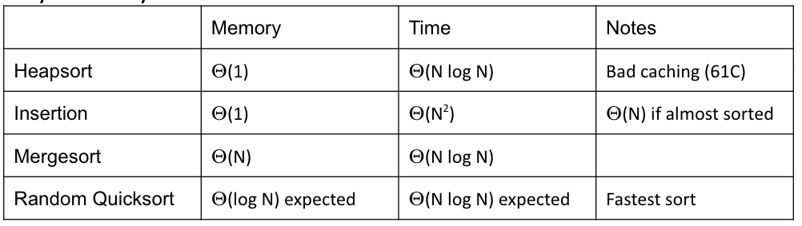
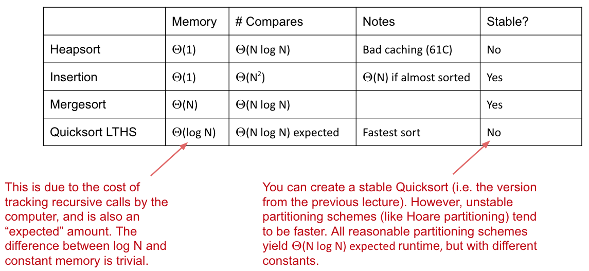

# Lecture 32: More Quick Sort, Sorting Summary
#### 11/10/2020

### Partition Sort a.k.a. Quicksort
- Quicksorting N items:
  - Partition on leftmost item
  - Quicksort left half
  - Quicksort right half
- Run time is Theta(N log N) in the best case, Theta(N^2) in the worst case, and Theta(N log N) in the average case

### Avoiding the Worst Case
- Four philosophies:
  - **Randomness**: Pick a random pivot or shuffle before sorting
  - **Smarter pivot selection**: Calculate or approximate the median
  - **Introspection**: Switch to a safer sort if recursion goes too deep
  - **Preprocess the array**: Could analyze array to see if Quicksort will be slow. No obvious way to do this, though

### Philosophy 1: Randomness (Preferred Approach)
- If pivot always lands somewhere "good", Quicksort is Theta(N log N). However, the ver rare Theta(N^2) cases do happen in practice
  - Bad ordering: Array already in sorted order
  - Bad elements: Array with all duplicates
- Deal with bad ordering:
  - Strategy 1: Pick pivots randomly
  - Strategy 2: Shuffle before sorting
- THe second strategy requires care in partitioning code to avoid Theta(N^2) behavior on arrays of duplicates
  - Common bug in textbooks!

### Philosophy 2a: Smarter Pivot Selection (constant time pivot pick)
- Randomness is necessary for best Quicksort performance! For any pivot selection procedure that is:
  - Deterministic
  - Constant time
- The resulting Quicksort has a family of dangerous inputs that an adversary could easily generate

### Philosophy 2b: Smarter Pivot Selection (linear time pivot pick)
- Could calculate the actual median in linear time
  - "Exact median Quicksort" is safe: Worst case Theta(N log N), but it is slower than Mergesort
- Raises interesting question though: How do you compute the median or an array? Will talk about how to do this later today

### Philosophy 3: Introspection
- Can also simply watch your recursion depth
  - If it exceeds some critical value (say 10 ln N), switch to mergesort

### Sorting Summary (so far)
- Listed by mechanism:
  - Selection sort: Find smallest item and put it at the front
  - Insertion sort: Figure out where to insert the current item
  - Merge sort: Merge two sorted halves into one sorted whole
  - Partition (quick) sort: Partition items around a pivot

### Quicksort Flavors
- Quicksort is the fastest, but only if we make the right decisions about:
  - Pivot selection
  - Partition algorithm
  - How we deal with avoiding the worst case

### Tony Hoare's In-place Partitioning Scheme
- Proposed scheme where two pointers walk towards each other
  - Left pointer loves small items and hates large or equal items
  - Right pointer loves large items and hates small or equal items
  - Big idea: Walk pointers toward each other, stopping on a hated item
    - When both pointers have stopped, swap and move pointers by one towards each other
    - End result is that things on left are "small" and things on the right are "large"
  - When pointers cross, you are done
  - Swap pivot where right pointer ends up
- This partitioning scheme yields a very fast Quicksort and is faster than mergesort
  - Though faster schemes have been found since
    - Best known Quicksort uses a two-pivot scheme
  - Overall runtime still depends crucially on pivot selection strategy!

### What if we don't want randomness?
- Another approach: Use the median (or an approximation)
  - The best possible pivot is the median
    - Splits problem into two problems of size N/2

### Median Identification
- Is it possible to find the median in Theta(N) time?
  - Yes! Use 'BFPRT' (called PICK in original paper)
  - In practice, rarely used
- However, while runtime is still Theta(N log N) this makes quicksort much slower than mergesort

## Quick Select

### The Selection Problem
- Computing the exact median would be great for picking an item to partition around. Gives us a "safe quick sort"
  - Unfortunately, it turns out that exact median computation is too slow
- However, it turns out that partitioning can be used to find the exact median
  - The resulting algorithm is the best known median identification algorithm

### Quick Select
- Goal, find the median
- Keep partitioning until the pivot lands in the exact middle of the array
  - Only need to partition the half that contains the middle index of the array

### Worst Case Performance of Quick Select
- Worst asymptotic performance Theta(N^2) occurs if array is in sorted order
  - Can mostly negate this using shuffling

### Expected Performance
- On average, Quick Select will take Theta(N) time
- On average, pivot ends up about halfway:
  - Number of compares: N + N/2 + N/8 + ... + 1 ~~ Theta(N)

### Quicksort with Quickselect
- What if we used Quickselect to find the exact median?
  - Resulting algorithm is still quite slow. Also: a little strange to do a bunch of partitions to identify the optimal item to partition around

## Stability, Adaptiveness, Optimization

### Other Desirable Sorting Properties: Stability
- A sort is said to be stable if order of equivalent items is preserved
- Equivalent items don't "cross over" when being stably sorted

### Sorting Stability
- Is insertion sort stable?
  - Yes
  - Equivalent items never move past their equivalent elements
- Is Quicksort stable?
  - Depends on partitioning strategy
  - Three array partitioning will be stable
  - Hoare partitioning may not be stable (we may swap equivalent items)

### Stability

### Optimizing Sorts
- Additional tricks we can play:
  - Switch to insertion sort:
    - When a subproblem reaches size 15 or lower, use insertion sort
  - Make sort **adaptive**: Exploit existing order in array (Insertion Sort, SmoothSort, TimSort)
  - Exploit restrictions on set of keys. If number of keys is some constant, can sort faster
  - For Quicksort: Make the algorithm introspective, switching to a different sorting method if recursion goes too deep. Only a problem for deterministic flavors of Quicksort

### Arrays.sort
- In Java, Arrays.sort(someArray) uses:
  - Mergesort if someArray consists of objects
  - Quicksort if someArray consists of primitives

## Sorting Summary

### Sorting Landscape
- The landscape of the sorting algorithms we've studied
  - Three basic flavors: Comparison, Alphabet, and Radix based
  - Each can be used in different circumstances, important part was the analysis and the deep thought

### Sorting vs Searching
- During the data structures part of the class, we studied what we called the "search problem": Retrieve data of interest
- There are some interesting connections between the two