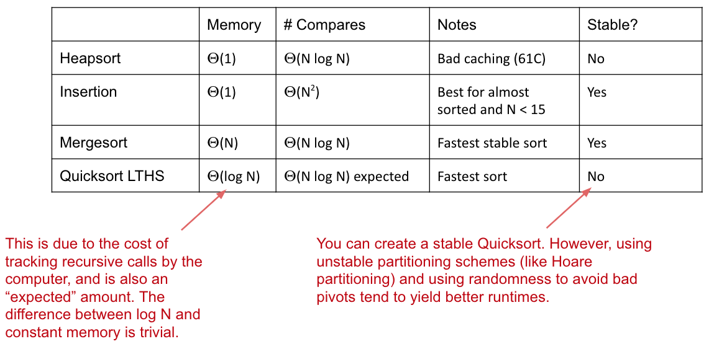
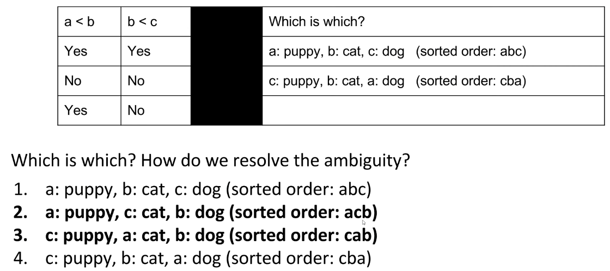
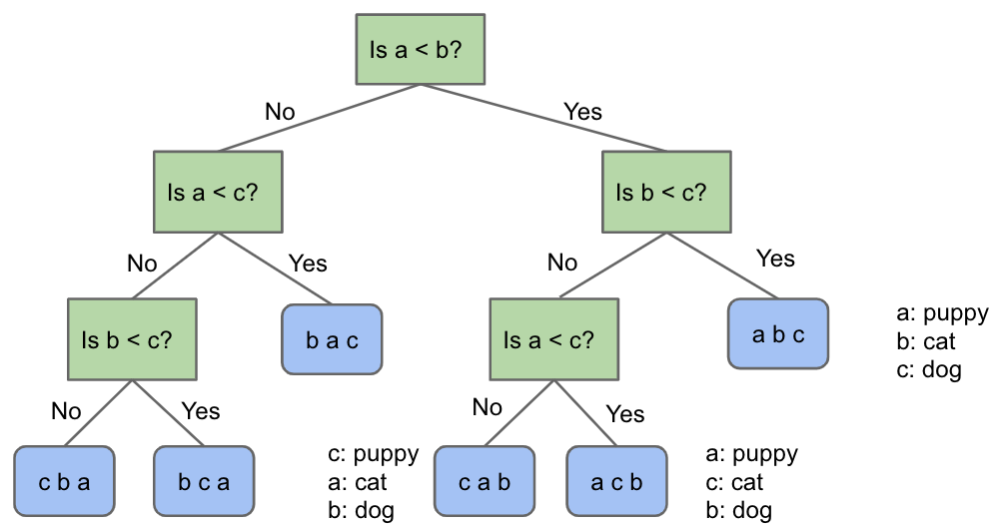

# Lecture 34: Sorting and Algorithmic Bounds
#### 11/16/2020

### Sorting
- Sorting is a foundational problem
  - Useful for putting things in order
  - But can be used to solve other tasks, sometimes in non-trivial ways
    - Sorting improves duplicate finding from a naive N^2 to N log N
    - Sorting improves 3SUM from a naive N^3 to N^2
  - There are many ways to sort an array, each with its own interesting tradeoffs and algorithmic features
- Today we'll discuss the fundamental nature of the sorting problem itself: How hard is it to sort?

### Sorts Summary

## Math Problems out of Nowhere

### A Math Problem out of Nowhere
- Consider the functions N! and (N/2)^(N/2)
- Is N! \in Omega((N/2)^(N/2))?
  - Can experiment and find that the above statement is true

### Another Math Problem
- Given that N! > (N/2)^(N/2), show that log(N!) \in Omega(N log N)
  - We have that N! > (N/2)^(N/2)
  - Taking the log of both sides, we can show the above statement
- In other words, log(N!) grows at least as quickly as N log N

### Last Math Problem
- Show that N log N \in Omega(log(N!))
  - log(N!) = log(N) + log(N-1) + log(N-2) + ... + log(1)
  - N log N = log(N) + log(N) + log(N) + ... + log(N)
  - Hence, N log N \in Omega(log(N!))

### Omega and Theta
- Given:
  - log(N!) \in Omega(N log N)
  - N log N \in Omega(log(N!))
- We can conclude that:
  - log(N!) \in Theta(N log N) AND
  - N log N \in Theta(log(N!))

## Theoretical Bounds on Sorting

### Sorting
- We have shown several sorts to require Theta(N log N) worst case time
  - Can we build a better sorting algorithm?
- Let the ultimate comparison sort (TUCS) be the asymptotically fastest possible comparison sorting algorithm, possibly yet to be discovered, and let R(N) be its worst case runtime in Theta notation
  - Comparison sort means that it uses the compareTo method in Java to make decisions
  - Worst case rn-time of TUCS, R(N), is O(N log N)
    - We already have algorithms that take Theta(N log N) worst case
  - Worst case run-time of TUCS, R(N) is Omega(1)
    - Obvious: Problem doesn't get easier than N
    - Can we make a stronger statement than Omega(1)?
  - Worst case run-time of TUCS, R(N), is also Omega(N)
    - Have to at least look at every item
  - But, with a clever argument, we can see that the lower bound will turn out to be Omega(N log N)
    - This lower bound means that across the infinite space of all possible ideas that any human might ever have for sorting using sequential comparisons, NONE has a worst case runtime that is better than N log N

### The Game of Puppy, Cat, Dog
- Suppose we have a puppy, a cat, and a dog, each in an opaque soundproof box labeled A, B, and C. We want to figure out which is which using a scale

  - We have to weigh a and c to resolve the final ambiguity

### Puppy, Cat, Dog - A Graphical Picture of N = 3
- The full decision tree for puppy, cat, dog:

### The Game of Puppy, Cat, Dog
- How many questions would you need to ask to definitely solve the "puppy, cat, dog, walrus" question?
  - If N = 4, we have 4! = 24 permutations of puppy, cat, dog, walrus
  - So we need a binary tree with 24 leaves
    - How many levels minimum? log_2(24) = 4.5, so 5 is the minimum
  - So at least 5 questions

### Generalized Puppy, Cat, Dog
- How many questions would you need to ask to definitely solve the generalized "puppy, cat, dog" problem for N items?
  - Give your answer in big Omega notation
- Answer: Omega(log(N!))
  - For N, we have the following argument:
    - Decision tree needs N! leaves
    - So we need log_2(N!) rounded up levels, which is Omega(log(N!))

### Generalizing Puppy, Cat, Dog
- Finding an optimal decision tree for the generalized version of puppy, cat, dog is an open problem in mathematics
- Deriving a sequence of yes/no questions to identify puppy, cat, dog is hard. An alternate approach to solving the puppy, cat, dog algorithm
  - Sort the boxes using any generic sorting algorithm
    - Leftmost box is puppy
    - Middle box is cat
    - Right box is dog

### Sorting, Puppies, Cats, and Dogs
- A solution to the sorting problem also provides a solution to puppy, cat, dog
  - In other words, puppy, cat, dog **reduces** to sorting
  - Thus, any lower bound on difficulty of puppy, cat, dog must ALSO apply to sorting

### Sorting Lower Bound
- We have a lower bound on puppy, cat, dog, namely it takes Omega(log(N!)) comparisons to solve such a puzzle
- Since sorting with comparisons can be used to solve puppy, cat, dog, then sorting also takes Omega(log(N!)) comparisons
- Or in other words:
  - Any sorting algorithm using comparisons, no matter how clever, must use at least k = log_2(N!) compares to find the correct permutation. So even TUCS takes at least log_2(N!) comparisons
  - log_2(N!) is trivially Omega(log(N!)), so TUCS must take Omega(log(N!)) time
- Earlier, we showed the log(N!) \in Theta(N log N), so we have that TUCS is Omega(N log N)
  - **Any comparison based sort requires at least order N log N comparisons**
- Proof summary:
  - Puppy, cat, dog is Omega(log_2(N!)), i.e. requires log_2(N!) comparisons
  - TUCS can solve puppy, cat, dog, and thus takes Omega(log_2(N!)) compares
  - log_2(N!) is Omega(N log N)
    - This was because N! is Omega((N/2)^(N/2))

### Optimality
- The punchline:
  - Our best sorts have achieved absolute asymptotic optimality
    - Mathematically impossible to sort using fewer comparisons
    - Note: Randomized quicksort is only probabilistically optimal, but the probability is extremely high for even modest N. So don't worry about quicksort