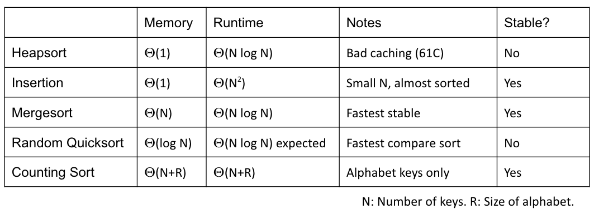
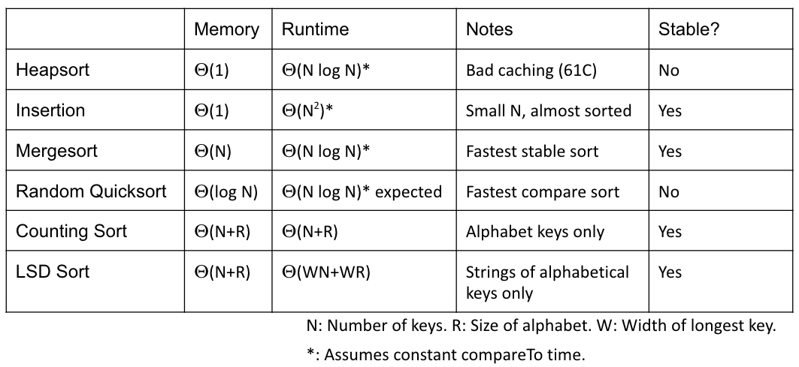
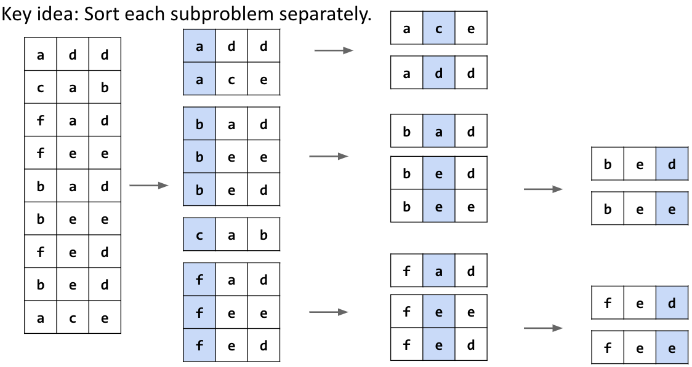
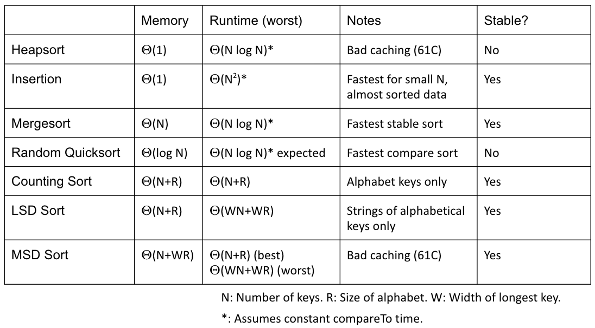

# Lecture 35: Counting Sort and Radix Sorts
#### 11/18/2020

### Comparison Based Sorting
- The key idea from our previous sorting lecture: Sorting requires Omega(N log N) compares in the worst case
  - Thus, the ultimate comparison based sorting algorithm has a worst case runtime of Theta(N log N)
- What about sorts that don't use comparisons

### Example 1: Sleep Sort (for sorting integers) (not actually good)
- For each integer x in array A, start a new program that:
  - Sleeps for x seconds
  - Prints x
- All start at the same time
- Runtime:
  - N + max(A)
- The catch: On real machines, scheduling execution of programs must be done by operating system. In practice requires list of running programs sorted by sleep time

### Example 2: Counting Sort: Exploiting Space Instead of Time
- Assuming keys are unique integers 0 to 11
- Idea:
  - Create a new array
  - Copy item with key i into ith entry of new array

### Generalizing Counting Sort
- We just sorted N items in Theta(N) worst case time
  - Avoiding yes/no questions lets us dodge our lower bound based on puppy, cat, dog
- Simplest case:
  - Keys are unique integers from 0 to N-1
- More complex cases:
  - Non-unique keys
  - Non-consecutive keys
  - Non-numerical keys

### Implementing Counting Sort with Counting Arrays
- Counting sort:
  - Count number of occurrences of each item
  - Iterate through list, using count array to decide where to put everything
- Bottom line, we can use counting sort to sort N objects in Theta(N) time

## Counting Sort Runtime

### Counting Sort vs. Quicksort
- For sorting an array of the 100 largest cities by population, which sort do you think has a better expected worst case runtime in seconds?
  - Quicksort is better
  - Counting sort requires building an array of size 37832892 (population of Tokyo)

### Counting Sort Runtime Analysis
- What is the runtime for counting sort on N keys with alphabet of size R?
  - Treat R as a variable, not a constant
- Total runtime on N keys with alphabet of size R: Theta(N + R)
  - Create an array of size R to store counts: Theta(R)
  - Counting number of each item: Theta(N)
  - Calculating target positions of each item: Theta(R)
  - Creating an array of size N to store ordered data: Theta(N)
  - Copying items from original array to ordered array: Do N items:
    - Check target position: Theta(1)
    - Update target position: Theta(1)
  - Copying items from ordered array back to original array: Theta(N)
- Memory usage: Theta(N + R)
  - N is for ordered array
  - R is for counts and starting points
- Bottom line: If N is >= R, then we expect reasonable performance
  - Empirical experiments needed to compare vs. Quicksort on practical inputs

### Counting Sort vs. Quicksort
- For sorting really really big collections of items from some alphabet, which algorithm will be fastest?
  - Counting Sort: Theta(N + R) (vs. Quicksort's Theta(N log N))
- For sufficiently large collections, counting sort will simply be faster

### Sort Summary
- Counting sort is nice, but alphabetic restriction limits usefulness
  - No obvious way to sort hard-to-count things like Strings
- Counting sort is also stable

## LSD Radix Sort

### Radix Sort
- Not all keys belong to finite alphabets, e.g. Strings
  - However, Strings consist of characters from a finite alphabet

### LSD (Least Significant Digit) Sort
- Sort each digit independently from rightmost digit towards left
  - i.e. start from least significant digit and work towards left

### LSD Runtime
- What is the runtime of LSD sort?
  - Theta(WN + WR)
    - N: Number of items 
    - R: Size of alphabet 
    - W: Width of each item in number of digits

### Non-equal Key Lengths
- After processing least significant digit, we may have keys that aren't of the same length. Now what?
  - When keys are of different lengths, can treat empty spaces as less than all other characters

### Sorting Summary
- W passes of counting sort: Theta(WN + WR) runtime
  - Annoying feature: Runtime depends on length of longest key

## MSD Radix Sort

### MSD (Most Significant Digit) Radix Sort
- Basic idea: Just like LSD, but sort from leftmost digit towards the right
- However, it requires a few modifications from LSD radix sort
  - Key idea: Sort each subproblem separately

### Runtime of MSD
- What is the Best Case of MSD sort (in terms of N, W, R)?
  - We finish in one counting sort pass, looking only at the top digit: Theta(N + R)
- What is the Worst Case of MSD sort (in terms of N, W, R)?
  - We have to look at every character, degenerating to LSD sort: Theta(WN + WR)

### Sorting Runtime Analysis
